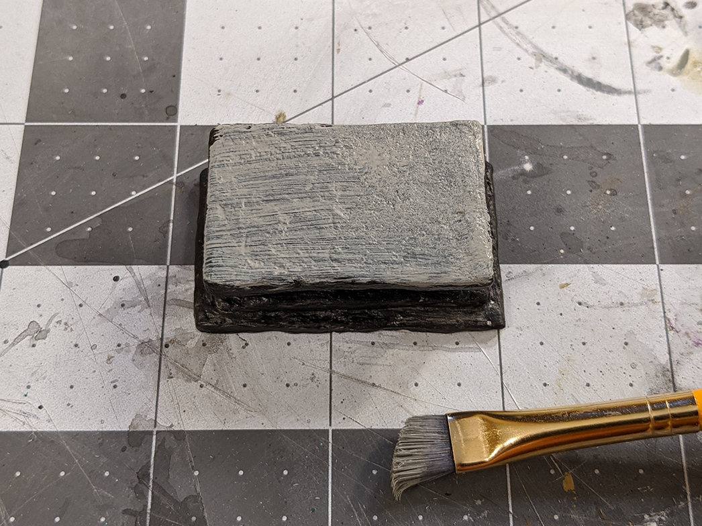
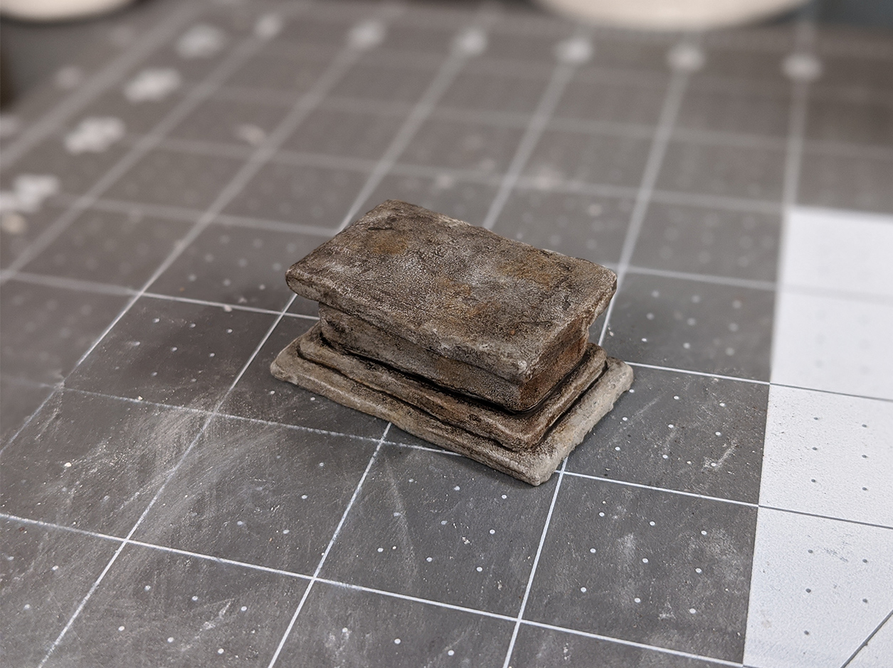
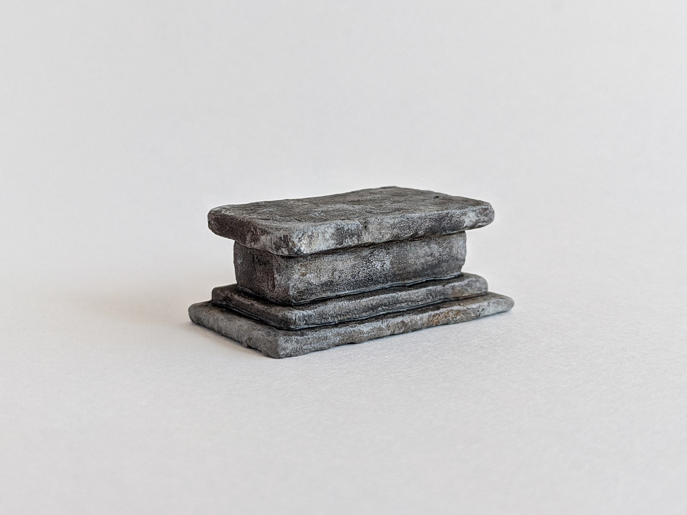

This is another piece I made to try out some new techniques. An altar seemed like a decent choice for a generic dungeon set. Now I could certainly have made one very quickly and easily with some XPS foam pieces, but I was feeling a little bored of the standard tin foil/rock/other-rough-surface texturing. So in my quest to discover all the ways to create cool looking rocky surfaces, I left behind the foam, except for use in the core structure. Something more like actual rock on the surfaces would be more exciting, so I decided to give plaster a whirl.

Here are the XPS foam pieces that I cut out. I made them smaller on most of the dimensions; some parts that are going to be connected to another piece, I skipped the downsizing there. For instance the big middle chunk of foam is cut narrower to leave room for the plaster layer, but it has the slab on top and underneath, so no plaster there, thus we want it to be the final height. And on the bottom slab, we don't need any plaster on the bottom, but we do want it on top, so it's a little thinner than we want it to be in the end. Anyway, I hope that makes sense, and it will make more sense as we put it all together.

So straight on to the plastering, I mixed some up to a medium consistency, kind of like frosting.

And like frosting, I spread it over my pieces of foam. I just used a popsicle stick first, and it was pretty unwieldy, (sorry that I don't have more pictures of this part) but after it had partially hardened after sitting for several minutes, I used some sculpting tools to scrape off the lumpy parts and get them mostly flat. But not too smooth, you know, because they still need some texture.

The pictures don't illustrate this very well, so here's where the plaster went on:

Top slab: coated on every side.
Middle chunk: coated only around the sides, nothing on top and bottom.
Next slab down: coated everywhere but the underside.
Bottom slab: same thing, plaster on every side except the underside.

Stacked and glued together. You can see there are pretty big gaps between the pieces.

With joint compound I tried to fill them in a bit. (You could also just use more plaster.) I wanted a little bit of a groove to remain, so they'd look like separate pieces still, but it kind of messed up the wash in that area, as you'll see.

For the first base coat of black paint and mod podge, I forgot to try and not leave crazy brush streaks. They do end up affecting the later layers of paint, in my opinion.

The streaks are a lot worse on the next coat of just grey paint. At this point I remembered to use a sponge instead.

Much better texture.

I couldn't get that big old sponge into all the corners, so I did have to use a brush there. It probably would have been worth it to cut part of the sponge to be a sharp corner and get into all the crevices that way.

To get some multicolor rock going, I took some orange-ish and brownish paints, thinned them down, and splotched them on. I dabbed away some of the excess with paper towel as I painted it on to get kind of a stained look.

I dry-brushed on some pure white highlights on most of the edges, and a few spots on the flat surfaces. I usually save the highlights for the end, but I felt like doing it differently this time.

Next, the wash. This one is a mixed brown and black.

Here it is dried. It actually didn't change after drying as much as things usually do when doing a heavy black wash. But on the parts where I did the patch job with joint compound, it really made that edge stand out. It reminds me of a hard water ring around the bathtub.

It's not super noticeable, but it still bugs me.

I dry-brushed on a few more grey highlights at the end, but was careful not to hit every edge. It's tempting to go nuts, because dry brushing gives you great looking highlights with such ease. But I've found that if you overdo it, your highlights get sort of chunky and rounded and lose some of the realism.

Here's an example of what I'm trying to explain; this is a practice rock I made that's also coated in plaster, that I just did way too much dry-brushing on. These are the kind of highlights I'm wanting to avoid.

So I think overall the paint job came out pretty decently, though maybe the brown and orange splotches have less of a natural rock look and more of a dirty look.

You can see that tub ring effect here. I'd like to figure out how to avoid that.

But, I'm really happy with how the texture came out. Plus it's got a good weight to it, as opposed to how light a foam-only piece would be.

The big downside was that coating pieces of foam in plaster is very cumbersome. Trying to get all the sides and running out of places to hold it gets frustrating, and the plaster you haven't used yet dries out in minutes, and then you have to mix more, et cetera et cetera.

Fortunately, I got some good ideas from some kind folks on <a href="https://www.instagram.com/p/CEmtSbMnT8p/" target="_blank" rel="noopener noreferrer">my Instagram post</a>. One suggestion was to combine my texturing methods; roll some tin foil over foam as usual, and then use some plaster to do some spot texturing over it. Another was to actually chisel the pieces out of an already-made chunk of plaster, and make them the way you would actually naturally work stone. I'm excited to try out both of these things on the next project that I get a chance to.

My ferret really wanted in on this photo shoot.

