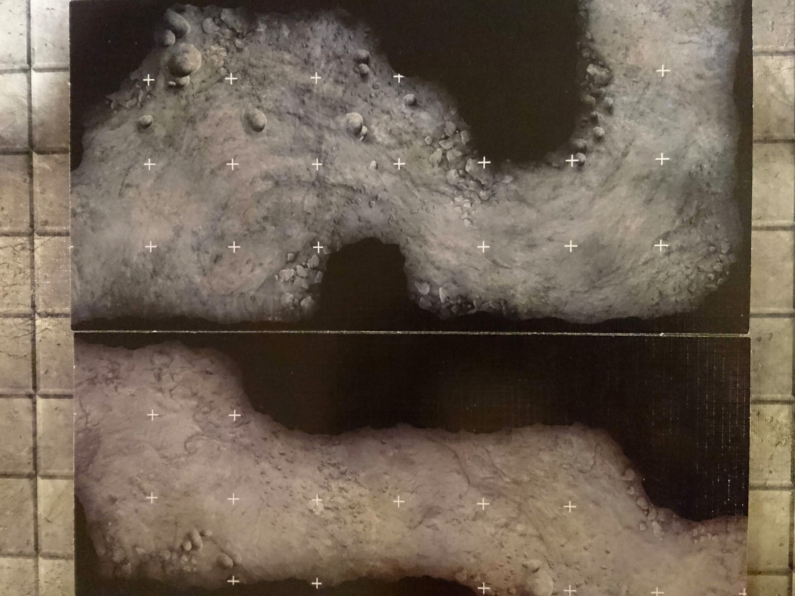

This post is the tale of the creation of our cavern tile set for tabletop dungeons. It was conceived mostly from a dungeon in the Lost Mines of Phandelver campaign, but ultimately made to be a generic, scalable set for playing D&D. We'll be using it for all the caverns to come.

  <i class="fas fa-exclamation-circle"></i>
  

    Since this dungeon set revolves so much around Lost Mines of Phandelver,
    there are pictures below that show some of the later content.
  

As a short introduction, I got into D&D with my husband Jimmy about a year and a half ago, and we started getting into making terrain 8 or 9 months ago. For this first campaign, everyone in our group was brand new, and Jimmy took up the mantle of DM. Being a player in the campaign, but still really really wanting to do the terrain anyway, I had to do what I could while knowing as little as possible about the dungeon we were making it for. I got the full story after the campaign was over, and have detailed the crafting journey here in its entirety.

As such, this post ended up being spectacularly long. It's a deep dive into everything from how we started out, decisions that were made about the design of the whole set, some details about the actual building (but not the actual crafting process, you can find links to that below), down to the problems we faced, and more. I've added some jump links below for your convenience.

Also, click the image links to see them at full resolution. Some have much better detail, and unfortunately some that I took with my potato phone don't look better at all.

Jump to (in page):

- [The Build](#starting-the-build)
- [The Features](#the-cool-features)
- [The Hiccups](#the-hiccups-and-lessons-learned)
- [The Bonus Lessons](#some-extra-lessons-and-tips)

  You can find the step-by-step processes for the different kind of tiles
  involved here:

- [Cave tiles](../making-a-cave-tile/)<i class="fas fa-external-link-alt fa-xs"></i>
- [Rectangular dungeon tiles](../making-a-dungeon-tile/)<i class="fas fa-external-link-alt fa-xs"></i>
- [Water tiles](../making-water-tiles/)<i class="fas fa-external-link-alt fa-xs"></i>

And some of the extra pieces here:

- [Stone pillars](../stone-pillars/)<i class="fas fa-external-link-alt fa-xs"></i>
- [Waterfall](../waterfall/)<i class="fas fa-external-link-alt fa-xs"></i>
- [Small water pool (the water test)](../water-effects-prototype/)<i class="fas fa-external-link-alt fa-xs"></i>

Our first D&D campaign lasted a little over a year. Since everyone was new, there was much exploring to be done. Starting out, our battle maps were drawn on grid paper, and we didn't even know that building your own terrain was even a thing. Our first exposure was <a href="https://www.youtube.com/channel/UC2Rlv-ug-mtnXuMwlpcqFgg" target="_blank" rel="noopener noreferrer">Black Magic Craft</a>, where we randomly found the video for building a ruined tower out of foam. After watching that we were immediately down the rabbit hole and bought a hot wire table and all the supplies we would need. For our first attempt we followed the <a href="https://www.youtube.com/watch?v=kxzUm3rFzBs" target="_blank" rel="noopener noreferrer">Basic Dungeon Tiles</a> video to craft a small set of our own tiles. We made different sizes to match our next dungeon, and it made for an extra awesome session. We felt so extravagant.

Instead of making more tiles for each battle map after that, we wanted to go all out on the final dungeon of the campaign, which was quite a ways away but would take a whole lot of prep time. Because this dungeon is HUGE. Printed or crafted at a 1 inch = 5 feet scale, the thing ends up being something like 6x8 feet in total. And we wanted to build the whole thing. We didn't really know how we'd do it all, so we just started at the beginning of the dungeon and would just have to see what we could pull off.

This dungeon was meant to be natural caverns with some parts carved and constructed into rooms and passages, so we had two different kinds of tiles that needed to be made: cavern tiles with irregular shapes, and the more classic dungeon tiles that are rectangular or square.

We started off by dividing the map into pieces that would fit into a 6x6-inch square, and that would have edges that were 2, 4, or 6 inches long. We wanted the tiles big enough that we wouldn't have to make so many, but small enough to be more modular and flexible. Beyond that constraint, we didn't really try to maximize their reusability; that would have just taken too much time and experimentation. Plus, basing our tile shapes straight off of a natural/organically shaped map gave us a lot of interesting and varied rooms and tunnels, unlike a tile set with a few common shapes (tunnel piece, corner piece, etc.) that ends up looking boxy when put together.

## Starting the build

All we had done so far were basic dungeon tiles, so we needed some new texturing and painting techniques. This was the first test of a few things I picked up from Youtube:

I originally wanted to put walls along all the edges, but we decided to make it a stretch goal, and add them at the end only if we had time. (Good thing, too.)

Our first batch consisted of the first room of the cave, plus a short way in each direction further in. (There was indeed no time to add walls at the end.)

The first setup: (extra props were all hand crafted, including that little rope hanging down from the stalagmite)

We're officially fancy.

After that we kept expanding the dungeon between sessions, trying to keep ahead of the progress of the group.

Near the end, after months of pumping out tiles, we were really feeling the burnout, and barely keeping up. So we started reusing the tiles we’d already made everywhere we could. The modularity of the tile set really came through here, thankfully.

Reusing tiles worked out well because the whole map wouldn't even come close to fitting on the table all at once anyway.

We spent almost 6 months in this dungeon (playing every other weekend, missing a week here and there) and it never got old. It was a great set to deck out with extra scatter, when we had time to make some.

For our final couple of sessions we wanted to take it up another notch, and we knew it would be super sweet to have some water tiles to make up the river running through the cave. I had wanted to make a small modular set of standalone river pieces that would sit on top of the tiles and be able to be used in different situations, but the process I came up with for making the banks of the river was too time-consuming to be feasible. It was a sort of last minute decision and we had less than a week to have it done. Instead I carved the river right into the tiles that the river would be running through.

You can find the process for making the water prototype (that little pool on the left below) [here](images/../water-effects-prototype/), and the process for the final water tiles [here](images/../making-water-tiles/).

You can also find the making of the waterfall [here](images/../waterfall/).

We were also finishing up our very last block tiles around this time, the tiles that would make up the final boss room. To make them stand out from the rest of the tiles, we painted them the standard dungeon grey.

We were also thinking of the future and about how the dungeons we'll be in probably won't be carved out of brownish caves.

The aforementioned final boss room:

See the making of the pillars [here](images/../stone-pillars/).

## The Cool Features

<h3 class="subheading">Magnets</h3>

Each piece connects magnetically every two inches along the inside edges. Instead of putting magnets directly into the tiles, we screwed in small screws, and use loose magnets between them as needed; this way, we don’t have to worry about trying to match the polarity between different tiles.

We haven’t found a good magnet solution for the square block tiles, because there are no definitive inside edges, so there would always be screws showing around the outside, and they would be poking out because of the grooves in the tiles.

### Mixing and matching

The tiles are made to connect to pieces with the same edge sizes, as shown here.

But you can also mix it up and combine multiple tiles on an edge, like below.

### Grid

We wanted some kind of indicators for a grid, to keep track of movement and range and such while doing battle, but an actual grid of lines sounded like it would really ruin our look. Instead we took some inspiration from some of the official Dungeon Tiles Reincarnated:

...and carved in small markers at the corners of each square inch. Those are the little plusses that you can see below.

Functional, while still being subtle.

## The hiccups, and lessons learned

Ideally, if you’re trying to make a matching set, you should make all the pieces in one go. This wasn’t possible for us, and we made them in batches.

For the blocky tiles, there was relatively little going on in the way of texturing, so they all came out pretty similar.

This is the most variation I could find.

But on the natural ground tiles, the texturing technique, among other things, was incredibly difficult to replicate.

These tiles are from different points along the several-months-long journey. The top left one is the very first. He was the prototype, where we tried out all our new ideas and mixed our different colors just the way we wanted. This was probably the biggest mistake of the whole project. When it came time to make all the rest of the tiles in exactly the same way, it was pretty much impossible. The texturing came out totally different, and for some reason, I did not have the presence of mind to write down the colors and amounts of the paints I mixed for the first tile. It took several hours at least, of many attempts, to get close enough to the original mystery color, and then over time we realized that the way it came out was totally dependent on the underlying colors in each coat, and the thickness of each layer of paint, and seemingly endless other things.

My attempts at getting colors right:

These are by no means instructions that anyone should follow. This is just my trial and error, to show a little of how much failure was going on.

In later batches, after a lot of failing and many hours of retexturing and repainting, we vowed never to use custom-mixed paints again, and I went down to Michael's and bought every shade of brown they had. We settled on a new set of colors that was clearly different from the previous tiles, but close enough.

As luck would have it, Michael’s was the only store to carry our main base color of light taupe, and of all the colors they could have decided to randomly quit stocking, that was the one they had to pick. It was even out of stock online. No other brand had another color that was similar enough, so it was back to mixing and matching. I did end up coming up with a recipe that was pretty darn close, and it worked out fairly well for the rest of the tiles.

Right side is the original, left is the one I mixed.

In the end there is a lot of color and texture variation, but fortunately it's less obvious when everything is laid out on the table. They're still fantastic as a tile set.

The grand total number of pieces made for this set is 124; 64 irregular cave tiles, and 60 square block tiles.

## Some extra lessons and tips:

1. If you're making a set for a dungeon that you'll be on a timeline for, make sure you allot enough time for making all the tiles you'll need. Calculate the time it takes to make a batch, if you're going that route, and how much time it will take you overall. And then add some more, because it will always take longer than you think.
2. Make your tiles in one batch, if you can. It's amazingly hard to go back and match colors and techniques. If you do have to go in batches, document your process very thoroughly. Don't believe yourself when you say you're sure you'll remember how you did it the first time.
3. When you decide on your paint colors, stock up. There's no telling when they're going to disappear off the shelves, and trying to replicate a color is a real pain.
4. Finish up with a couple of coats of a matte or satin polyurethane spray. This is something I only got around to doing on the first batch we made. When you stack these boys and leave them for a while, they're likely to stick together in places. I had some sticking going on even weeks after they were finished.

This was an enormous and overly ambitious endeavor, and making a set like this is probably more time and effort than most people are going to want to put in. If you're looking for something that's going to take less time and that you can mass produce more easily, I'd take a look at the <a href="https://www.youtube.com/watch?v=wNL4Y06-8JE" target="_blank" rel="noopener noreferrer">cave tiles from Black Magic Craft</a>. We took some inspiration from his process, but we wanted to take it a few steps further when it came to the design, the shapes, the natural look of the textures and colors, etc. and I think the amount of work it took was worth it, and we have caves for the rest of our lives.

_Here's another bonus shot of a multi-level part of the dungeon. We used some of the rectangular tiles to improvise some walls and stairs, because we didn't have time to make any._

