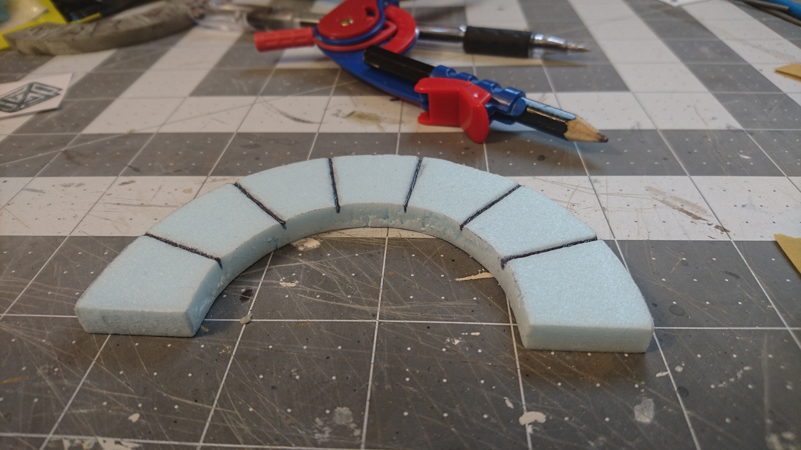
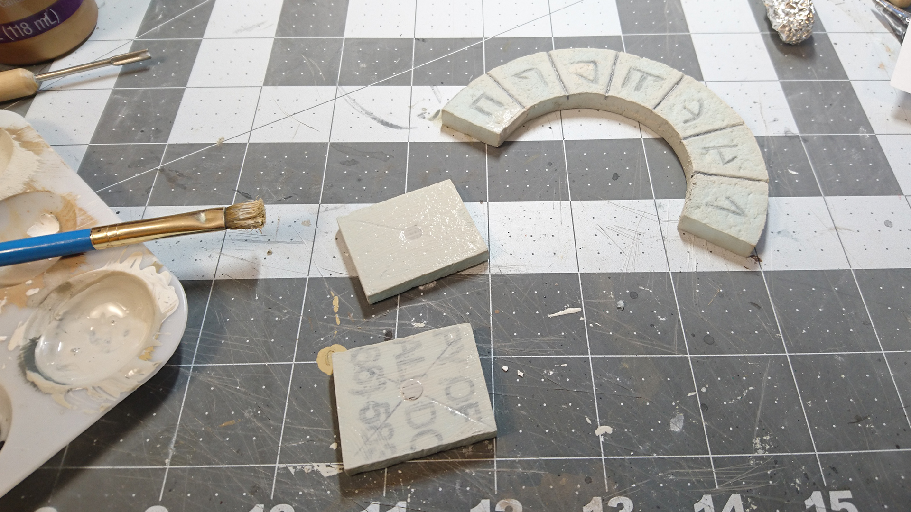

This [giant cave entrance](images/../cavern-entrance-part-1/) was made with reusability in mind, so I made it modular by making a few of the pieces removable and interchangeable. Nothing changes functionally, the different pieces are just for a change in theme and flavor.

Here's the original set, with demonic runes shaded in dark red.

The new set I left without any extra color; I thought the simple engraved look worked best.

So let's get going with the process.

Starting with the side panels, I used the original panels to trace onto new pieces of foam, then cut them out and tested the fit.

For the engraved designs, I grabbed some Dwarven-ish-looking symbols off the internet, and printed them out at the size of the panels. I started with a couple different sets, halfway wanting to make them both, but I ended up just picking one.

I stuck the printed out patterns onto the panels with some blue tack, then traced over them with my metal compass tip.

The paper is a little thick to trace through and get down into the foam, but with some extra pressure and patience, you can get it on there well enough to see.

And then you can go over the faint lines with a pen to get the depth where you want it.

Switching gears over to the arch piece, I sliced a piece of foam to the same thickness as the original, then traced around it.

And then made some not-exceptionally-smooth cuts with my exacto knife.

Some sanding cleaned that up a bit.

First test fit! It's got some problem spots.

I'll address those later. First, I'll use the original arch piece to mark where the divisions between the segments are.

I did that on the inside and the outside edge, and then used my blunt pencil to connect the marks and create the stone divisions.

Then with a ballpoint pen, deepened the lines as much as I could get away with without tearing it up.

With my pencil I drew in some Dwarven runes. These are from the 5E Player's Handbook.

Now to take care of those problem spots. I gobbed some joint compound all along the spots where there were gaps in the fit.

Once that was dry, I sanded it down to be smooth.

Next test fit! It's better, but there are still some gaps. I decided to just let it slide.

I noticed too late that one of my Dwarven runes happened to be almost identical to one of the demonic runes on the other arch piece. In an attempt to change it to something else, after I had already carved it into the foam, I carved in a similar one, and then filled the mismatching lines in with joint compound. I tried to give it a rough texture to hopefully match the texturing I'll be adding to the foam later.

I went over the symbols some more with the pencil, to thicken the lines and make them a little deeper.

Standard procedure of rolling a ball of tin foil over the foam to create the rough texture.

Same thing on the side panels.

Then it's time for the magnets in the backs of the panels. Just carved out magnet-sized holes in the centers, and popped them in with some white glue.

I almost screwed myself over big time when it came to the paint job. When I was painting the main cave entrance and the original demonic set, two months earlier, I clearly remember thinking, _This is a super simple paint job. There's no way I'll forget how I did it._

So yes I completely forgot it.

But by the miracle of past-me listening to a tiny sliver of doubt, I did jot it down, and even more miraculous, I was able to find it in the mess of random notebooks that lie around the house.

So let's start with the base coat: as you've seen, it's 2 parts white, 1 part tan, 1 part grey, and some mod podge.

Now a second coat of the same color, without the mod podge. (The mod podge gives it a slightly glossy texture, and it takes on the next layers better if it's more matte.)

The first black wash:

After drying, we can see that it's still too light. (But we knew we'd need two washes anyway, thanks to the magic paint formula.)

So on goes the second black wash.

Much better, almost there.

Just needs the final step, the dry brush in the color of the base coat.

Heeey it matches! I admit I was a little worried up to this point. I've had bad experiences trying to replicate past paint jobs.

This removable arch piece ended up being a little too tight of a fit. To get it out I have to get a flat sculpting tool or a knife or something in there and pry it out. If I do that many more times, I'll probably damage the arch and/or the frame that it sits in, so I may have to shave down the edges a little, somehow. Or maybe come up with a better way of taking it out.

The end. We finally used this in our campaign last month, as the entrance to an ancient Dwarven city.

For the finale here's a sweet action shot from the photographer in our party.

