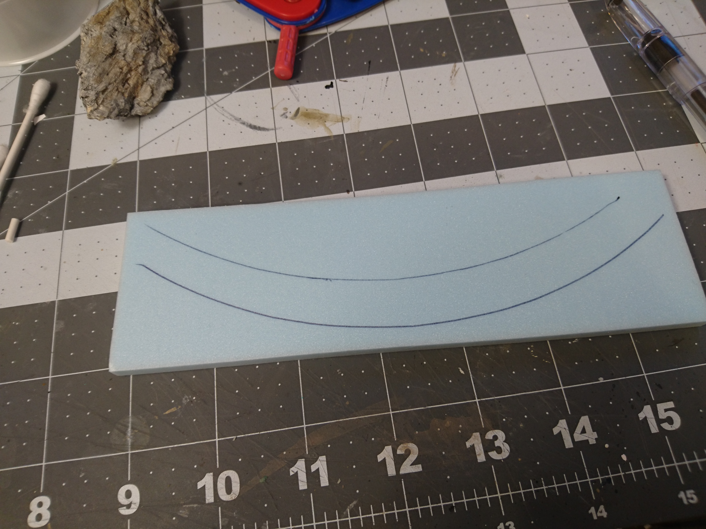
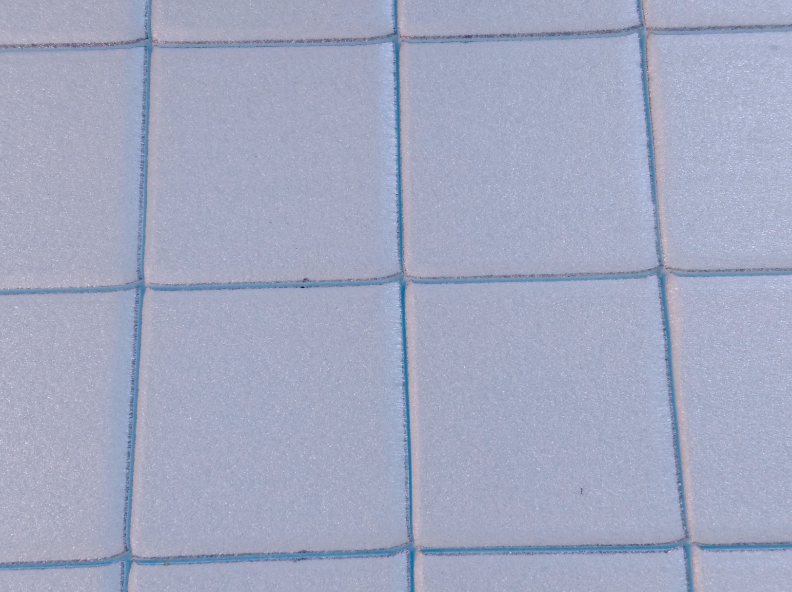
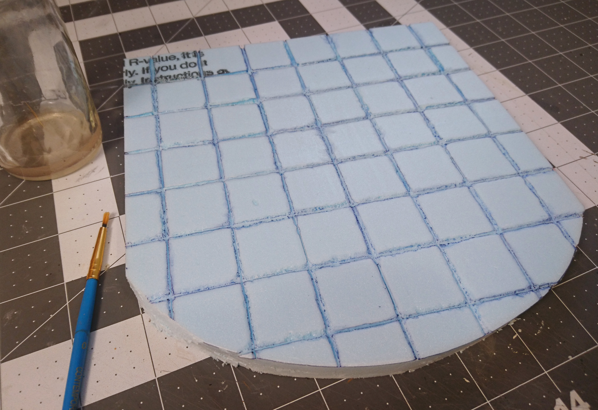
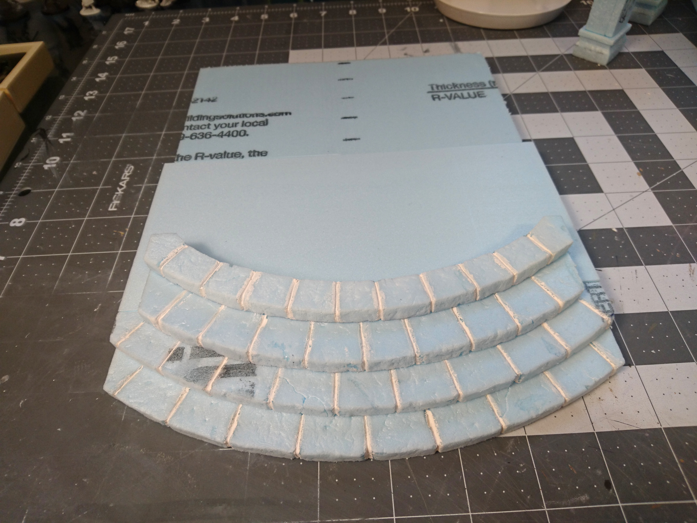

- [Part 1: Building the arch](../cavern-entrance-part-1/)
- Part 2: Creating the foam floor and structure (you are here)
- [Part 3: Adding the wood chip and plaster rocks](../cavern-entrance-part-3/)
- [Part 4: Final step, painting](../cavern-entrance-part-4/)

In this post we'll be adding the rest of the foam structure to our cavern entrance, as you see above, building around [the arch that we made in part 1](images/../cavern-entrance-part-1/), that you see below.

First thing we're going to work on is the steps. I planned out 4 step levels; I have 1/2" thick sheets of XPS foam, which I'll slice in half to be 1/4" thick, so using those the top level of the floor will be 1" from the very bottom.

I printed out some oversized concentric circles to cut out and use as templates. This is the fourth or fifth printout after trying out the size with the arch several times. I had a tough time getting the scale right.

This is the innermost circle, for the top step. I forgot that this piece is going to be a curved row of stones that borders the rest of the tile floor, so I actually needed another smaller circle printed inside this one.

I nudged the template back about half an inch and tried to use that for the second curve, but as you can see it didn't quite line up.

I had to just fudge the lines and try to get a consistent width along the length of the piece, then I cut it out with an exacto knife.

On the lower steps I traced and cut only the outer line.

Here's the top two steps:

Continuing down the rest of the steps, these are the pieces I ended up with.

For the tile floor at the top, I took a bigger piece of foam, the original 1/2" thick, and traced the inner curve of the top step onto it.

With a few scraps for supports, here are the steps and the floor stacked together.

To make the individual stones in the step pieces, I first drew the outlines very lightly in pencil. I started with the top step, and then continued down, spacing the lines halfway between the lines above, in a regular alternating brick pattern.

Then with my exacto knife, made some shallow (maybe 1/8"?) cuts along them, as well as down the front.

I used my blunt pencil to widen the gaps between the stones as much as I could.

To take it further, I took some sandpaper and rounded off the edges even more. I also used the sandpaper to dig out some chips in the stone, and add some overall unevenness.

I still wasn't happy with how small the gaps between the stones were, so I painted a little nail polish remover in all the cracks to widen them up some more. This was just my preference, and I was still experimenting with just about every aspect of the texturing here.

Here it is repeated on all the steps. You can see I overdid it in several places, which is okay because I'll be doing some filling in later on.

Before we get to that though, let's get caught up on the stone floor piece. I'm starting out by drawing a 1-inch grid over the entire surface.

Then, same as with the steps, I made shallow cuts down each of the lines. I do this before using the ballpoint pen to prevent too much pulling and tearing.

It's possible that I could have gone straight to using the nail polish remover here, but I didn't want to risk it untested, and I didn't really feel like taking the time to start over on a scrap piece.

Here the lines have been widened with a pen.

The main reason I go on to melt the gaps down more with acetone is to get rid of this problem that pops up when you cross lines. The very tips of the corners just get pushed over to one side, instead of becoming more rounded.

So using a small brush, I painted over all the lines with the nail polish remover.

Remembering, of course, to pour the nail polish remover into a glass or metal container, and not a plastic cup, because obviously nail polish remover is acetone, and will eat through plastic and dissolve paints and inks and all sorts of other things. Everyone knows that.

_\*cough\*_

So here's a closeup of the lines at this point. We have nice roughed-up edges, but the cuts I made with the exacto knife are still pretty prominent. The paint isn't going to magically fill those lines in, unfortunately. I have tried it. That's why we'll fill them in with some "grout" later on.

I skipped sanding down the edges of each stone the way I did the steps, because the acetone took care of all that, but I wanted to rough up some of the surfaces still, so I did some patchy sanding.

Then I drew in some cracks. I only did a few of the stones, and certainly could have gotten away with doing more.

And for the final step in my standard texturing process, rocks and tin foil.

Same deal with the texturing on the steps.

Now for the "grout". I mixed up some plaster of paris and watered it down pretty heavily, to the point where it would flow more easily into the cracks. It was pretty tedious; I scooped up a bit onto a tiny sculpting tool, spread it into a gap, and wiped away the excess. Then rinsed and repeated about a hundred times. Thus is the curse of being meticulous.

Repeat with the steps.

The steps are now ready to be put together. The very bottom step wasn't quite long enough in the back to fully support the one above it, so I glued on an extra piece.

After gluing on the second step, I cut the excess off the back so I could stick on a regular 1/2-inch-thick piece of foam to extend the base.

And then on go the last two steps. I also had to add another extension onto the back to make it big enough. That piece is just stuck on with glue at this point, and will probably fall off if moved, but it will be fine after we glue the floor piece on top.

(Somehow I'm missing a picture here with the floor piece added on, so we'll just have to move on.)

With the base complete, it's time to start building up the cave opening.

Devoid of any better ideas, I started out by gluing together stacks of scrap pieces of foam. Then I freehanded them through the hot wire cutter to chisel away some of the corners, and try to round them off.

Fortunately, this is just for structure, and none of this will be visible, so how it looks doesn't actually matter.

Getting the last bits of the top of the arch to fit together was tricky.

Once I had all the pieces cut, I glued all the stacked pieces together, but I didn't glue them together in the middle, at the top of the arch. I also haven't glued it to the base yet. In the pictures below the two sides are just balanced against each other. It looks atrocious now, but all I need is something that I can start gluing things onto.

This concludes all of the foam parts of this piece. At this point the separate pieces we have are the base (the floor and the steps), the decorated arch that we made in the previous post, and the left and right sides of the rock tunnel.

In the next post we'll start sticking a _whole_ lot of wood chips all over the outside of our beautiful tunnel.
