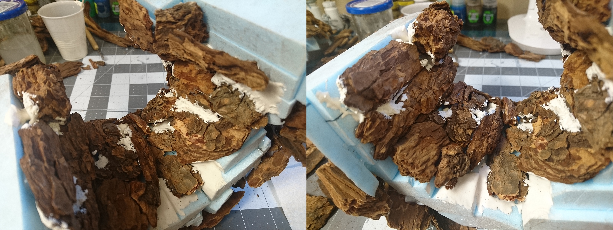
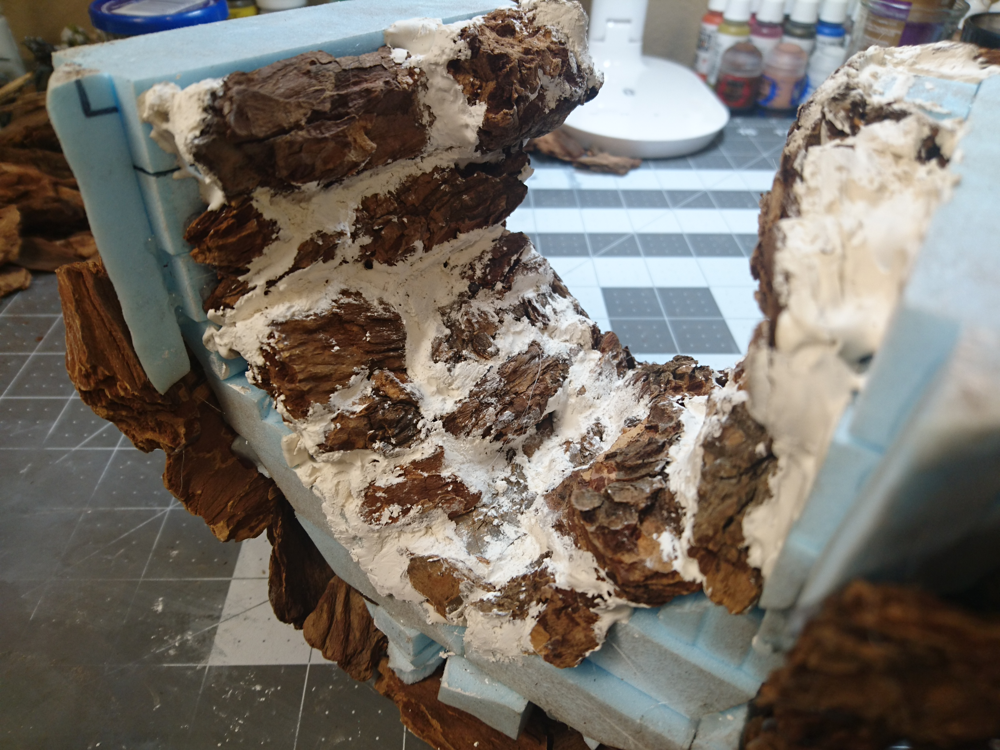

- [Part 1: Building the arch](../cavern-entrance-part-1/)
- [Part 2: Creating the foam floor and structure](../cavern-entrance-part-2/)
- Part 3: Adding the wood chip and plaster rocks (you are here)
- [Part 4: Final step, painting](../cavern-entrance-part-4/)

Here's where we'll be after this leg of the journey:

And here's where we're starting from, made in the previous [part 2](images/../cavern-entrance-part-2/):

We'll start by using wood chips to create the texture of the rocks. I got a giant bag of bark nuggets from the hardware store, I think it was a 2-cubic-foot bag. It sure looks like a lot more than 2 cubic feet. I'll certainly never need to buy any more. You want the big nuggets in particular, not the finer mulch that looks like a bunch of twigs.

Materials straight from the outdoors are great; they add a really nice touch of realism, but they need a little prep before coming to live in the place you sleep at night. You can use heat to kill any creepy crawlies that might be lurking, and for a bonus, get rid of the moisture in your wood. I'm no expert on this, but I did as much reading as I could on other builders' methods, and I decided to go with cooking them in the oven. The recommendation I came across suggested 200&deg; F for 10 minutes. I set my convection oven to 175&deg;, spread out some wood chips on a foil-lined baking sheet, and popped them in. I kept a very paranoid eye on them for a solid 15 minutes, half expecting them to burst into flame, even though I knew the temperature was low enough.

They got warm to the touch, but didn't seem to be getting any hotter as time went on. 10 minutes didn't seem like very long to me, so I just left them in there for a couple hours, to be extra thorough. I'm not a fan of bugs. My house was filled with a very woody, earthy smell that really wasn't unpleasant. It was gone by the next day.

After the heat treatment, the wood chips are ready for use. Time to break out the hot glue gun.

If you haven't guessed it, the reason I left the foam structure of the tunnel unattached to the floor, and in two separate halves, is so I have full access to the underside for this next part. I fortunately had the foresight to realize that there was no way I'd be able to texture and paint the inside of the tunnel after it was...inside. However, I'll need the tunnel pieces fully attached before sticking wood chips onto the outside, at least around the bottom. So I'm going start to finish on the underside first, paint and everything, before assembling it.

Here's the beginning of the gluing expedition.

What I discovered right away about the wood chips is that they are _**absolutely packed**_ with tiny pokies. After handling just a few, all of my fingertips were full of micro-slivers.

I went to unreasonable lengths to try and remedy this on my next batch of baked wood chips. First I hosed them off in a bucket, tried to rinse them off, laid them out to dry most of the way, and then threw them in the oven as usual. After that I took a small, stiff brush and actually scrubbed them off individually, trying to clean them off as much as possible. I sat down with a plastic grocery bag of them and spent nearly a whole morning on that part. I'm usually pretty chill about the tedious parts of building things, but that was too much even for me.

After doing that once, I ditched all the extra steps and just put on a pair of nitrile gloves.

These few pictures are actually spanning days. It wasn't full days of work, just a couple hours here and there, but this must have been the longest step. I wanted the rocks to be shaped like rocks, and not just look like wood chips, so I really agonized over the placement of each piece, holding it up to a potential spot, and then swapping it out for the next one from the bag, and then the next one, so on and so forth. I spent so much time not actually doing anything that I had to make myself just glue a random piece on in a random spot, and just deal with what came out. I had to force myself to do that continuously throughout the whole gluing process.

Here's the underside of the tunnel, with all its wood chips. I glued the two sides together once I got to the top of the arch. In places where they ended up too far from the foam skeleton, I shoved in some hot-glue-covered scrap pieces to fill in the gaps.

I mixed up some plaster of paris to fill in the exterior gaps.

There were a lot of gaps.

For the base coat, I'm using mod podge mixed with black paint. I'm starting with black as the base here because, well, I guess it should be dark inside.

Sort of looks like lava rock.

Next I did a dry brushing with dark grey.

And after that, a lighter dry brushing with regular grey. All the rest of the rocks are going to be based with white, so it's alright if we go a little nuts on lightening it up in here.

After the underside was finished I was able to attach the arch and the tunnel to the base, and then I started adding wood chips all over the outside.

And 13 days after starting the wood chip adventure, they're finally all on.

The number is misleading, I worked on this off and on and don't know how much time of actual work it was. I can estimate it at about 4-6 hours, but that's only going off of the pictures I took.

I didn't even try to manage the hot glue strings. All I did was pull off what I could before going on to the next step.

Now we have a whole lot of gaps to fill. I got out the plaster again and started plopping it in. It was a problematic workflow to figure out, because the plaster mix dried up so fast. I could only prepare a little at a time, and when that batch dried, I had to get a fresh cup for the next one, as I couldn't mix it properly on top of the uneven, dried up layer of the last batch.

The picture below is maybe halfway or so through the plastering process.

In addition to filling up holes, I used the plaster to try and sort of blend the wood chips together and create more unified surfaces that would hopefully look more like rocks.

Here's the back, getting closer to finished. At this point I haven't figured out what I'm going to do with the back of the floor, whether I'm going to just paint the edge black, or do something different.

After forcing myself to be mostly satisfied with the filling job on top, it's time to take care of the bottom. I added a lot of scraps around the edges where I needed some support.

I felt like I should fill some of the gaps down here, so I tried to get some plaster in, but didn't even come close to filling it completely. There's a lot more empty space in there than it looks like.

After the plaster fully dried, I glued the whole thing to a large sheet of chipboard, and filled the rest of the gaps around the bottom with more plaster. Unfortunately, as I should have anticipated, the glue and the plaster caused the chipboard to shrink and warp a little, and the edges and corners all curled up.

How to fix this? I don't really know. When I held the corners down and flattened the chipboard, I exposed this gap around the bottom. Maybe if I kept the board flat and filled the gap, it would just stay flat.

So I put various heavy objects on each of the corners, crammed more plaster into all the crevices, and let it dry like that.

The result: It helped a little, but it didn't eliminate the warp. But it was better, and not all that noticeable, so I didn't pursue the problem further.

So let's move on to taking care of the back. I decided to make the tiled floor transition into rocky ground as it went further back. To that end, I needed to add some wood chips to the rear floor, and of course, they would need some extra room. I used nail polish remover to melt away a big chunk of the foam.

I was then able to fit in some carefully selected wood chips to be the new floor.

Later I went back in with some more nail polish remover and plaster to create a more uneven and natural-looking transition between the tiles and the rock, which you can see in the later pictures.

After the new floor was plastered in, the plastering was finally, at long last, finished.

Just the cleaning up left to do. I didn't spend much time smoothing out the plaster while it was still wet and moldable, so most of it was weirdly lumpy and didn't transition smoothly into the wood chips. With my sculpting tools I chiseled and scraped until it looked as rocky as I could make it. I didn't want to smooth it out entirely though, there were some rough and jagged parts that were better left as they were.

Lastly, I used a utility knife to cut away the excess chipboard from the base.

Here's the finished texturing on the interior floor:

And here we are, at the finished structure. Everything is ready, it's on to painting from here.

