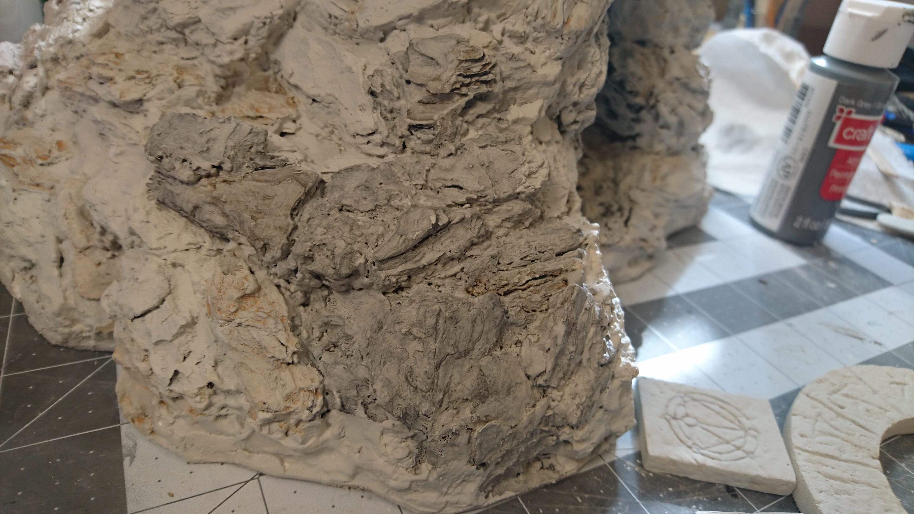

- [Part 1: Building the arch](../cavern-entrance-part-1/)
- [Part 2: Creating the foam floor and structure](../cavern-entrance-part-2/)
- [Part 3: Adding the wood chip and plaster rocks](../cavern-entrance-part-3/)
- Part 4: Final step, painting (you are here)

Here we are, all set for the final stretch. All the construction is finished and we're ready to paint.

For the base layer I mixed some grey, white, and tan paint together. I think it was roughly equal parts. Then I added some mod podge to the mix.

So far so good.

After the first pass, which was a lengthy endeavor on its own, I had little gaps and crevices all over the whole thing to deal with. They only required an extra gob of paint over each of them, but they were endless. When I thought I was done with an area, I'd rotate it just a bit and see a bajillion more gaps.

Of course I didn't get them all, but eventually I had to call it quits and move on.

Right now, in the back we go straight from white to the black interior, but we'll fix that with more painting later on.

Can't forget the removable pieces.

The idea I had for painting the rocks was to put on some splotchy brown first, to create some subtle variations in color for the final product.

Here's the brown wash I started with.

I was really nervous about trying out a new technique, and had really no idea how it would turn out. I was pretty light handed with this color for that reason, but I needn't have worried. As it turned out, this was either not enough color, not by a long shot, or the brown should have gone on later, after other painting steps were completed. Spoiler: it's all going to basically disappear.

Added some color to some of the stone tiles as well.

After that it was a black wash over the whole thing. The wash went on a lot differently than I expected. Really seemed to just disappear into the cracks.

After drying, it looks okay I guess.

The first pass didn't really give me the effect I was looking for.

I was feeling like I needed some deeper shadows in different areas, so I went in with a thicker black wash and went pretty ham with it.

It looked pretty terrible at first.

But the only way to fix it was to keep going, so I black-washed and I black-washed until I got to a place I could live with.

By this point the brown is just about all gone.

I could have done the brown wash thing again at this point, but I think I was too afraid of messing up what I'd spent so much time and near-failure getting to.

Switching gears over to the removable arch pieces, I did two black washes, trying to mimic what I did on the main rock piece. Then to make the symbols stand out, I painted inside them with a watered-down red.

I wish there was some way I could keep the wet look, it was a lot cooler of an effect, kind of blood-like.

The last step is a dry brushing. I tried two different colors: linen (a sort of cream color), and some grey mixed with white.

I ended up not really being able to tell much difference between them. You probably can't tell in the picture below that the two different colors are used on different parts there.

So I just used both of them randomly, pretty much over the whole piece. And on the edges of the removable pieces, of course, though I don't have them shown here.

And finally, we've reached the end. I'm always bad about keeping track of how long I spend working on each project, (or rather, I just don't remember to do it, ever) so I can only estimate based on the photos I took. From those I can gather that I worked on this on 25 different days, give or take, spread out over almost 3 months. Lots of down time on this one. And if I had to give it a number of hours that it took, that's a lot more guesstimating, and rounding when I probably shouldn't, but if I'm going off of pictures taken, I could _maybe_ put it at around 40-50 hours. Things like prepping the wood chips, creating and printing out paper templates, and whatever research and planning I did, I didn't keep track of, so I can really only add an arbitrary number of hours for those things.

Anyway, here's all the final shots.

My final thoughts, mostly on the texture, are that overall it's at least decent looking. It's not everything I hoped for, but I feel pretty okay about it. Some bits here and there I really like, and look like really cool actual rock formations, but stepping back and taking the whole thing in from certain angles, it just screams _wood chips_ at me. I think wood chips are better for smaller pieces, little outcroppings, and mini bases, but I don't think I'd use them again for a giant rock like this.

(Below: I saved this piece of bark from the very beginning to use in a prominent spot because I liked it so much. It doesn't look quite as cool as it did in its former life.)

I do really like the way the interior of the tunnel contrasts with the outside.

In the back I managed to blend it from black to white pretty smoothly.

I have another set of pieces coming up soon, this next one is going to be Dwarven-themed.

