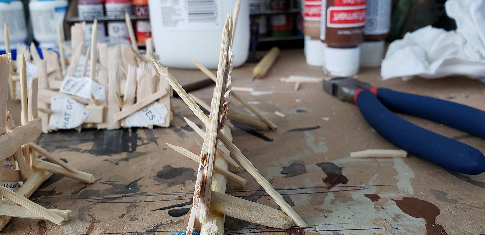

  A guest post from DM Jacob. See his other posts here:
  <ul>
    <li>
      <a href="../guest-post-dungeon-walls">Dungeon walls</a>
    </li>
    <li>
      <a href="../guest-post-big-rock-terrain">Big rock terrain</a>
    </li>
    <li>
      <a href="../guest-post-doors">Doors</a>
    </li>
  </ul>

For the goblin barricades I used popsicle sticks, barbecue skewers, tooth picks, a dowel, heavy paper, and small twigs from my yard that I sterilized in the oven.

I used a mini to help decide the average height of the barricade planks.

Next I used a rotary tool and an olfa knife to add texture to all the wood. Hopefully this will make them look like they were crudely put together by goblins. For skinnier planks I split popsicle sticks in half.

Here I laid one horizontal plank and glued different sized vertical pieces to it at haphazard angles. Its fine to leave some spots more open.

I covered some of the bigger holes with thin cardstock from food packaging and heavy paper to act as tanned leather hides. I used a clay sculpting tool and a pen to press holes into the edges so it would appear that the hides were nailed to the barricade.

After the glue dried I took some bigger twigs and dowel rod pieces and glued them to the bottom of the barricades. I hoped that this would look like a large log or a felled tree that the monsters nailed the barricades to.

I also added some angled supports at the end of either side so the barricade will stand on its own. I held the log for each barricade in place with a piece of poster tack while the glue dried.

Here I attached the paper and added more sharpened stakes poking out of the barricade made from toothpicks and barbecue skewers.

For an added effect I took some Citadel Skulls and drilled a hole in the bottom with the smallest drill bit I had. If you do this, go slow and be very careful especially if you don't have a vice.

I used super glue and glued the skulls to the tips of some of the wooden stakes.

For painting I primed the pieces and did a base coat of dark brown followed by a lighter brown coat.

Next was dry brushing. I think I used a golden brown.

Then I painted the heavy paper with different colors to make them look like leather.

Then just mix a little lighter color to the base and dry brush with that.

Finally the wash. Here I tried three different washes. Agrax Earthshade, Army Painter brown wash, and a home made wash made from craft paint and dish soap. I liked the Army Painter wash the best and since I don't have anything I currently use that for, I washed all the pieces with the Army Painter wash.

I painted the skulls with Vallejo Bone White.

For the wash I applied Nuln Oil to some to make them look older and Cambion Crimson to others to give them a fresh look. On the Cambion Crimson skulls I let some of the wash run down the stake.

Build complete!

