

  This is a guest post from DM Jacob. You can check out his previous projects here:
  <ul>
    <li>
      <a href="../guest-post-dungeon-walls">Dungeon walls</a>
    </li>
    <li>
      <a href="../guest-post-big-rock-terrain">Big rock terrain</a>
    </li>
  </ul>

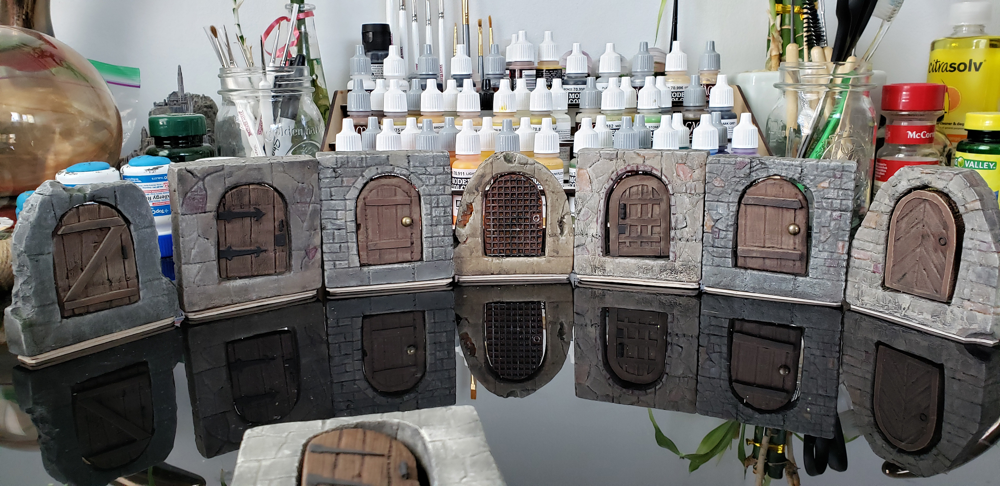

I cut out a 3-inch x 3-inch piece of 1/2-inch XPS foam just like for a dungeon tile, and draw the shape of the door I want on one side using the 1-inch grid marks as a guide.

Note: Make sure you measure the bottom to be flush with whatever you are using for dungeon tiles. If the bottom of the door frame is too short, your door won't be able to open. If you do make this mistake like I did, you can glue cardstock to the bottom of the piece until it is the right height. I've included of picture toward the end where you can see the difference.

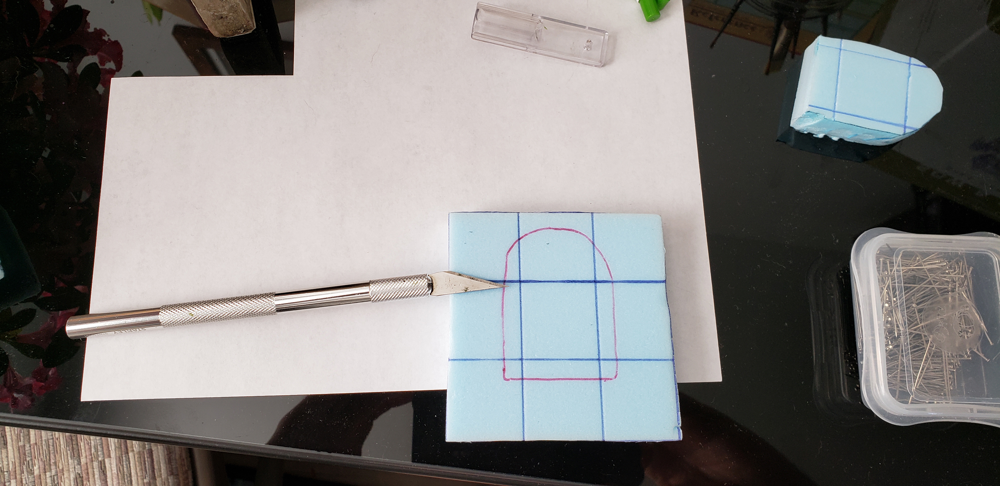

Since these will be standing up they need some weight in the bottom to keep them up. I place one 1/2-inch lag bolt into the bottom. It's important to cut out a piece of the foam for the head to sit in so it will be flush. Once the depression is cut out, screw the bolt in until it is at least flush with the bottom.

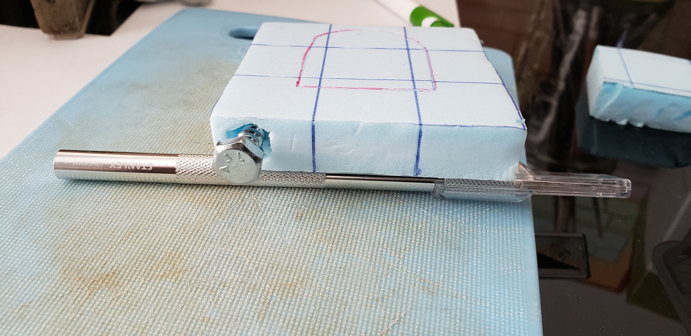

Cut out the door with an exacto knife or hot wire tool. Remove the cutout and cut that in half, so it is half the thickness as the door frame.

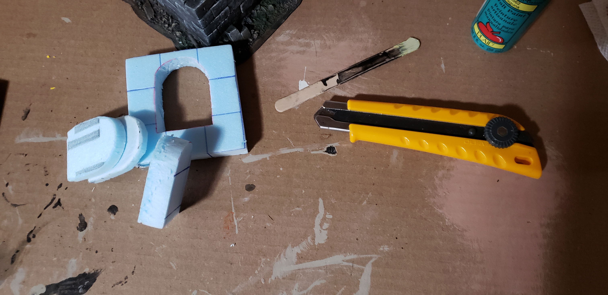

Fill in the depression with the lag bolt with some hot glue and stand the door up on a sheet of baking paper as the hot glue dries. This will make sure the depression is filled in and flush.

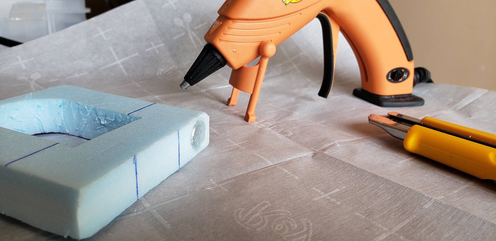

Using a small file or sand paper, smooth out the door and the inside of the door frame. This will also create space for the door to swing freely without getting stuck.

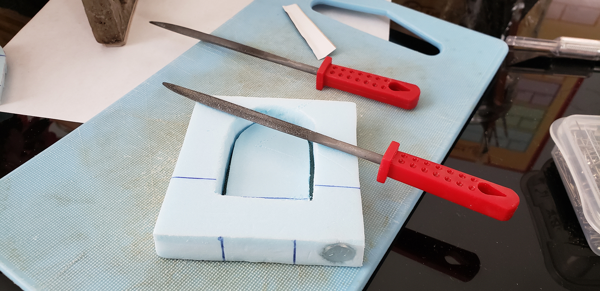

Add any design or texture to the door frame and door that you wish.

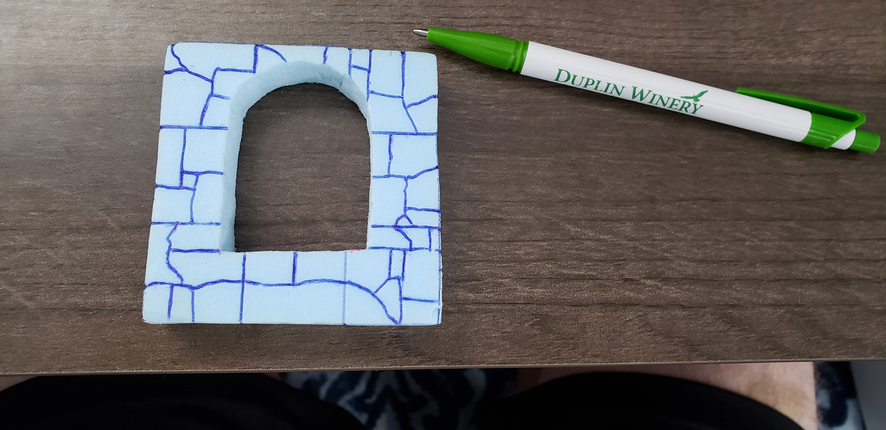

On this door, the handle is made from a tooth pick and the banding is cardboard from a food box. I applied tacky glue to set these but PVA glue should work just fine. To get the wood grain lines in the door planks I used a wire brush.

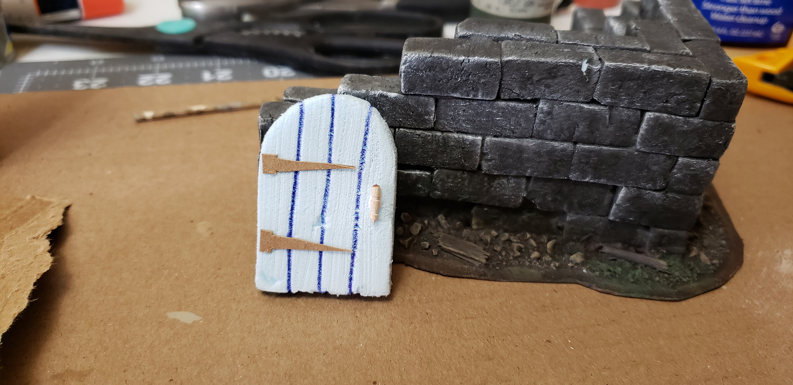

I applied a mix of mod podge and black paint to seal the pieces. Once that was dry, I base coated the frame with tan and added suede and vanilla drybrush highlights and a black wash. I painted the door brown with golden brown highlights and the handle and bands were painted black. I used a brown wash on the door.

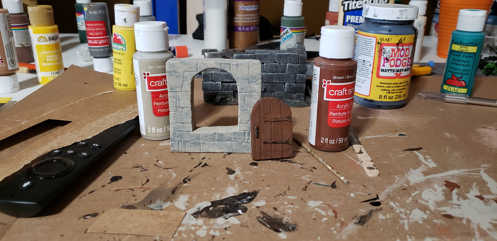

I used two sewing pins to attach the door to the frame. One through the top and one through the bottom. When you set them, make sure you have enough space on either side of the door to allow it to open freely. Add a small amount of PVA glue to the pins and the press them into the frame so they do not stick out.

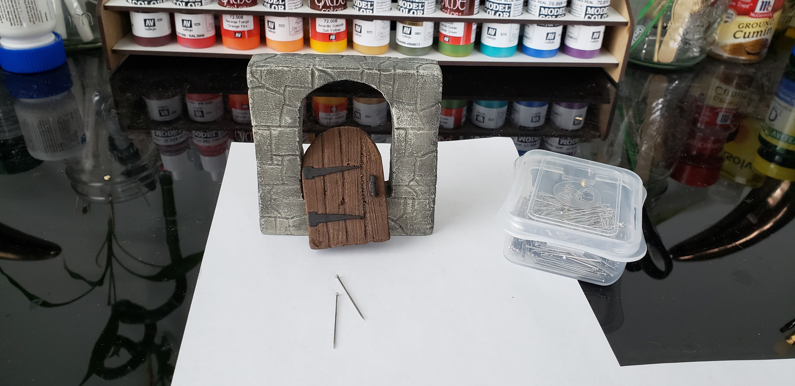

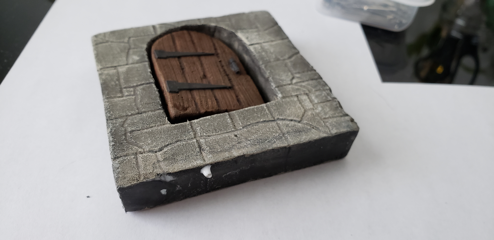

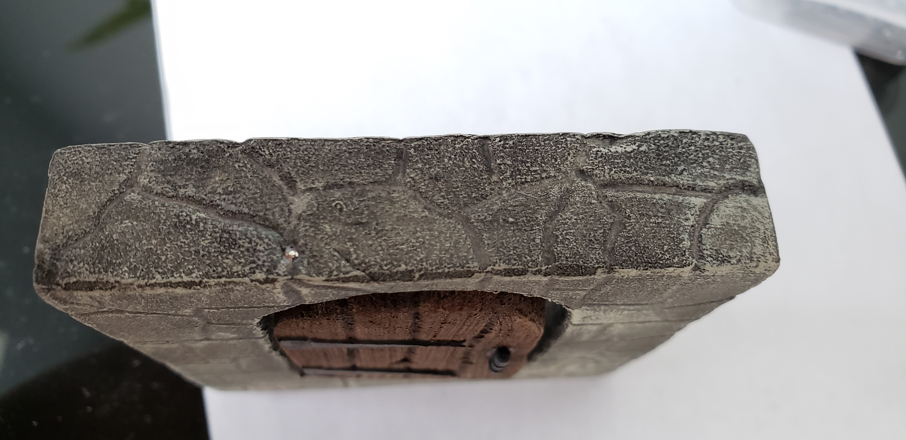

After the glue is dry cover it with a small amount of mod podge and paint it to blend in with the rest of the piece.

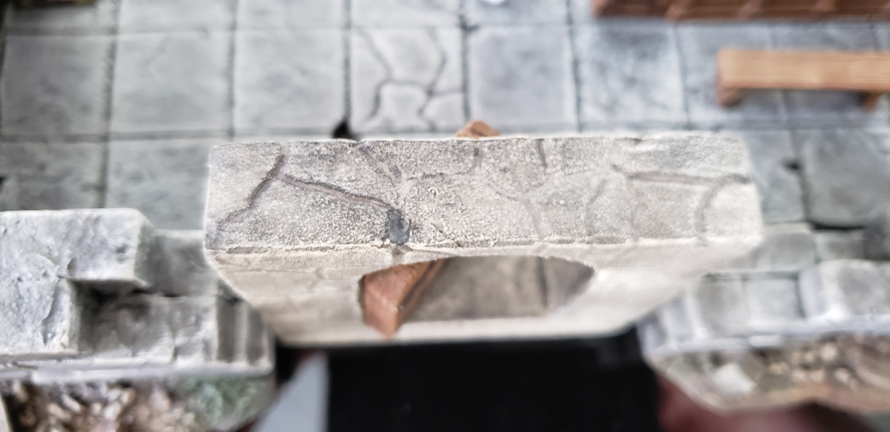

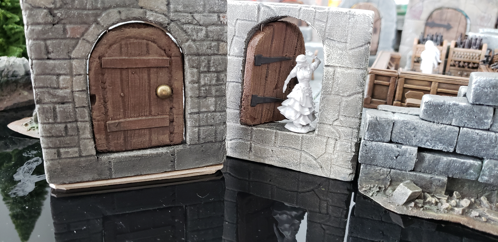

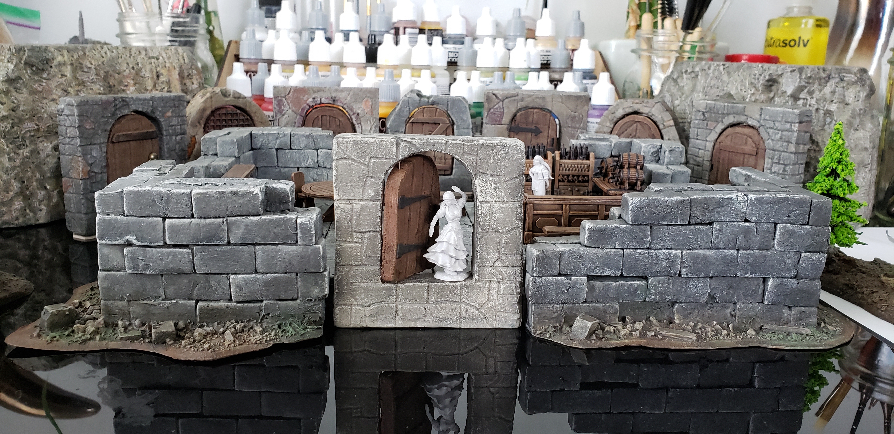

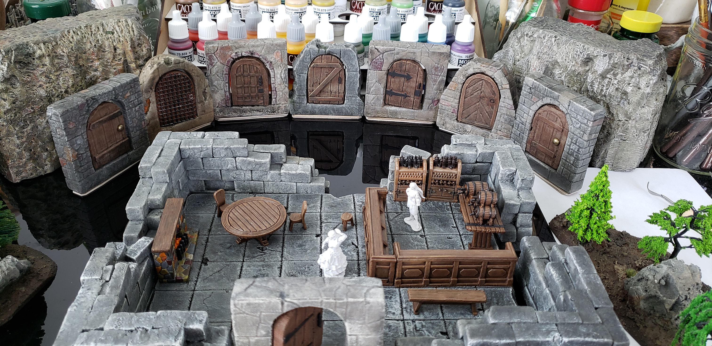

Here you can see where I raised the bottom of these doors with cardstock to be flush with our dungeon tiles.

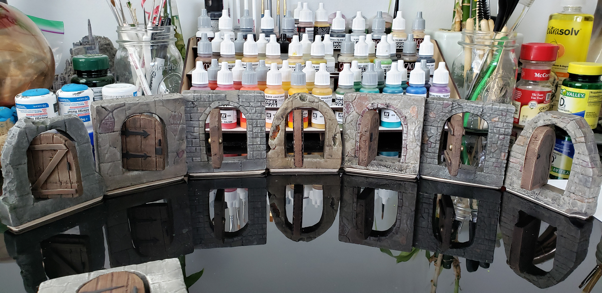
