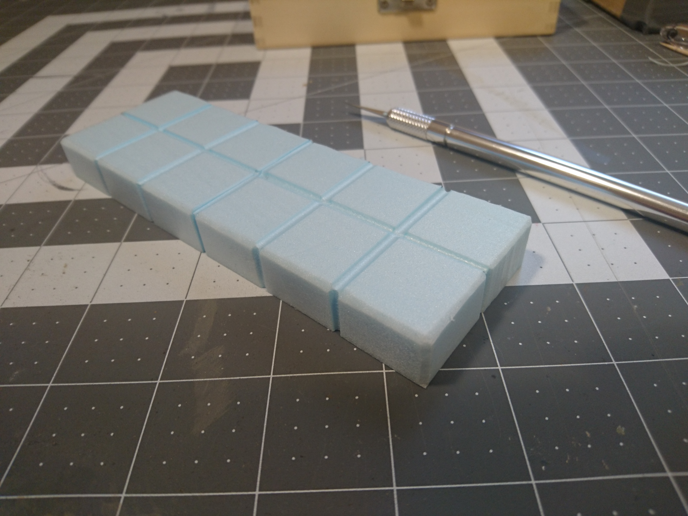
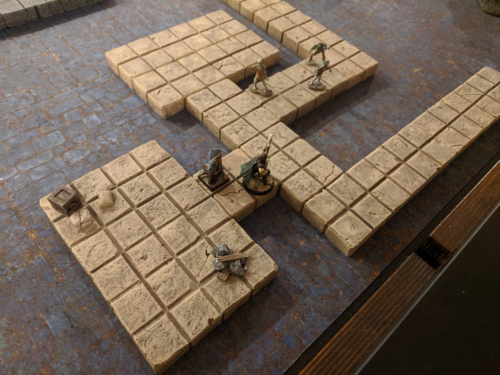

These dungeon tiles are brown to match the cavern tiles in our [cave tile set](../cave-tile-system/). Each side is either 2, 4, or 6 inches long. In this post I'll be going through how to make a 2x6-inch tile.

Starting out, we need a 2x6-inch rectangle of 1/2-inch thick XPS insulation foam. I've made small marks with a pen at every inch along the sides, as guides for cutting the grooves.

The grid is made by cutting grooves between the individual tiles in the piece. This can be done with nothing more than a ballpoint pen or a pencil, using the tip to "draw" in the indentations and then going over them heavily to widen them, but I like the wider and deeper lines that I can get with a hot wire cutter.

By briefly touching the side of the foam to the wire, I can melt away a nice big grout line. The depth and the width of the groove will vary based on the heat setting, how far into the foam you go, and how quickly you move in and out.

Continuing the grooves down the sides adds a lot to the overall look of the piece.

This is what we have after making all the crosswise gridlines.

Unfortunately, the wire cutter is just barely too short to make the grooves along the length.

So we're just going to cut the whole thing in half, then put it back together after we melt the rest of the grooves in. You can of course just make smaller tiles if you have this problem, but I preferred to stick to my 2-4-6 inch form factor, and not have quite so many small tiles.

There are a couple ways I have made this cut: the first way was to cut right down the center of the middle groove. I did this with most of the tiles I had to cut like this, and the resulting seam after putting it back together is not very noticeable.

This is the other way I wanted to try, going right along the edge of the groove instead of down the middle. I thought having the seam at a transition point would reduce the visibility of it.

This way didn't end up looking as seamless as I thought it would. Here's a comparison between the finished version of this tile (left), and another tile where I made the cut right down the center of the groove (right):

Back at our hot wire table, this is what we have after the cut.

Two pieces that will fit under the cutter arm nicely.

After melting in the lengthwise grooves (remembering to go down the sides on each end) we can stick the two halves back together.

For a little added stability I'm putting a piece of toothpick inside.

Looking at this later I realize that piece of toothpick is woefully short. Still, it's probably not completely useless.

We poke a hole in one side, stick the piece of toothpick in, then line it up with the other half, using the toothpick to make an indentation where we'll poke the other hole.

Then remove the toothpick, fill the hole with some white glue (I used tacky glue, regular old PVA glue is also fine) and put the toothpick back in. Then cover everything with more glue like so:

And then just fit the two halves together and clamp them. I used scrap pieces of foam to protect the ends of the tile from clamp marks. If you've got any glue squeezing out in the middle, now is the time to wipe it off.

I left a tub of rocks on top of the tile while it dried to make sure the clamp wasn't causing any bowing upwards or downwards.

I usually let these dry for a few hours, but they're probably ready long before that.

Here's the finished seam from our cut:

Now we're ready to start texturing.

First, to wear down those sharp edges, we're going to slice them off with an exacto knife.

We'll go around all the top outside edges, and down the sides on each corner.

With the exacto knife we're also going to chip off some bits from the edges and corners, and even a few places in the middle of the tiles.

Then we'll make some real cracks. You can use a ballpoint pen to carve these in. I like to use this pointy metal end of a compass.

Continue the cracks down the sides for the full effect.

For some overall texture I grabbed some rocks out of my garden and rolled them all over the surface. This can be a tedious process as you want to use all different sides of the rock so you don't get repeat patterns. Also I found that after a while the foam would partially spring back to its original shape, so I had to try and imprint the rock texture extra hard to retain the detail.

Here's a closer look at the texture we got.

There are still a lot of smooth spots, so we'll go over it with some balled up tinfoil to add a little more roughness overall.

The amount of texturing you do is really up to your preference. I've done some tiles with only rocks, or only foil, or both.

Now the texture is all done, and it's time for paint.

The first coat is mod podge mixed with some of the main base color of paint; in our case, light taupe.

Then a second coat of the same color, without the mod podge. I've found that having mod podge in this second coat makes the wash (which is the next step) not stick very well.

When the second coat is dry, we do a dark brown wash. This wash is some dark brown paint, a little black paint, a lot of water, and a drop of dish soap. You can be very liberal brushing this on, you can see I've put on so much it dripped all over.

Make sure to move it around every so often while it's drying, so it doesn't get stuck to the cardboard, or whatever you're setting it on.

After the final long wait, here it is all dry.

Next thing we're going to do is take our main base color, light taupe for this tile, and give the whole tile a really heavy dry brushing.

Here I've done the dry brushing on the top row of tiles.

And then the whole thing.

Next we start on some highlights. For our first highlight we used DecoArt's Fawn, which is a very fleshy color. But any brown that's lighter than the base color should do.

This time we're doing a much lighter dry brushing, focusing on the edges and corners on the individual tiles, and any raised edges of the cracks and chips that we want to bring out.

In this picture I've done the highlights only on the bottom row.

The effect is very subtle here, it's more noticeable in person.

Here's the first round of highlights all done.

The last color is an even lighter brown. We used Folk Art's Camel, which is really more of a yellow.

It's very bright compared to the other colors, so we have to make sure that we have barely any on the brush when we do this last coat, and that we brush it on very sparingly.

I was being so cautious with it that it's hard to pick it out in this picture.

And with that, this tile is complete. An optional step you could add onto the end would be to spray on a couple coats of a matte polyurethane spray; this will add some durability to your paint job and keep it from sticking to other tiles.

Here's our new tile as part of the set.

