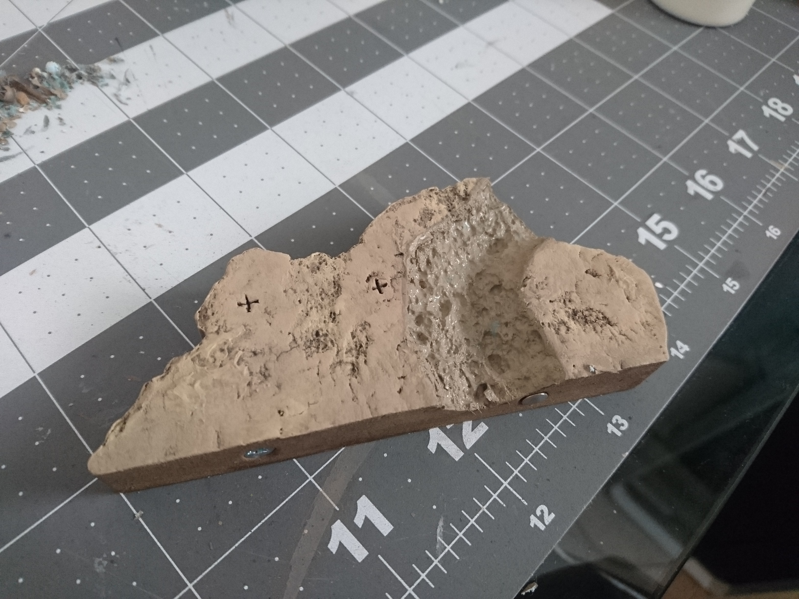

After finishing the [test water piece](../water-effects-prototype/), it's time to make the river tiles that will fit into the finished cavern (More on the cave tiles [here](../cave-tile-system/)).

I had originally planned to make modular pieces of river to sit on top of the existing tiles, but since I hadn't come up with a good looking technique for texturing the outer edges (banks) of the river that I could get done in a short amount of time, I had to build the river right into the tiles.

Here's the outline of the river for the first piece penciled in. I started painting the nail polish remover right on, hoping it would just eat through everything.

It sort of worked, though it didn't do anything to the caulk at all.

I had to peel off a lot of bits of paint and caulk, which was pretty tedious, and then I used more nail polish remover to melt it down to a riverbed sort of shape.

Then the base coat of mod podge/dark taupe paint went on.

The pencil lines are really hard to see here, but this is the outline for the rest of the river in this section.

I kept running into the problem of the paint getting in the way and not dissolving enough. It took an awful lot of acetone to get through the layers of paint, and using so much made it so that the acetone would eat away at the foam underneath before I could get enough of the paint off.

I found it better to brush some acetone onto the paint to soften it up, and then scrape it off.

After all the paint was cleared away I was able to melt the foam in a much more controlled way.

All the pieces for this section are ready to be painted.

I don't have pictures of the painting process for these tiles, because we were in crunch mode, it was late at night, and the light we were painting by was terrible.

We did use the same painting technique as I did for the [prototype pool](../water-effects-prototype/).

For pouring the resin, I followed <a href="https://hirstarts.com/tips17/tips17.html#plan" target="_blank" rel="noopener noreferrer">this tutorial from Hirst Arts</a> as closely as I could for my situation.

This involved using scraps of foam with clear packing tape covering one side to cover the ends of the river at the edges of the tiles.

This worked well for the flat edges of the tiles, but at the ends of the river where it leaves the tile at a curved edge, a flat piece of foam would not be able to seal it.

I could have ended the river just short of the edges of the tiles and eliminated this problem entirely, but I didn't want the river to start and end from nowhere, I wanted it to be coming from and going somewhere, so I chose to make my life more difficult.

My solution was to put a piece of packing tape (folded in half so there would be no sticky side) over the end and shove a piece of blue tack up against it to kind of mold it around the curves. Then I could put my piece of foam against the putty and hold it place like the other pieces. Theoretically.

Now I just had to figure out a way to hold the pieces of foam tightly against the edges of the tiles. The odd shapes prevented my being able to use clamps (and I only had two clamps anyway, and several pieces to work on, and not enough time to do them one after another while waiting for each to dry). As I think about it again after the fact, I probably could have done something with electrical tape, or just something I could wrap tightly around the whole piece... But I had to come up with a solution quickly, and so I tried to follow the Hirst Arts tutorial, which just says to push the piece against something heavy to hold it in place.

The next step is to spread some 5-minute two-part epoxy over the edge of the piece where it meets the foam to seal off the crack and prevent the resin from seeping out.

I did this part outside because the fumes from the epoxy I used (JB Weld) are particularly horrendous, and I didn't want to bathe my brain cells in them. So I hauled out whatever I could find that seemed heavy-ish and not too big, and tried to use weight to hold everything together.

It was not the greatest solution.

I made some really difficult angles for myself, the wasps were super interested in everything, and in 90-degree weather 5-minute epoxy becomes 2-minute epoxy, but eventually I got all the pieces sealed.

As soon as they seemed decently dry (I only waited a few minutes longer after finishing the epoxy), it was right to the pouring. I wanted a full two days for them to cure before I handled them, so I had to get this part done quickly.

The first pour, the scariest part.

Spent about 20 minutes doing the rest of the pouring and wracking my nerves.

In hindsight, I should not have filled the riverbeds with resin up to the very top of the edge. The way I painted them, the green came up all the way to the level of the ground, so that is where I filled them to.

In addition, I had checked that my surface was level beforehand, but after pouring the resin some of the levels looked off in some way. I tucked in a few paper towels under the cardboard to try and correct it, and that was probably a mistake.

And here we see the first problem child to emerge.

This was maybe 20-30 minutes after pouring; it looked like the resin was seeping over the top edge, but I couldn't tell if it was also leaking out of the bottom somewhere.

Over the next hour or so we started seeing more overflowing, even on straight edges like the one below.

I was really puzzled here because the overall level of the resin seemed to be far enough below the ground level on other parts of the tiles. It was almost like the resin was expanding or something.

This was a particularly bad one, though it looks like the tile itself is just too uneven.

There was nothing to be done about it but to wait and see how they turned out. I had an overblown fear that all the resin would leak out overnight, so I covered the whole floor around the table with newspapers and cardboard just to be safe.

After the first night of curing, (thankfully there was no lake of spilled resin) a lot of bubbles had formed.

I went through with a dress pin and popped all the ones that I could, but apparently I should not have done that. I came back after a few hours, and there were more bubbles. I popped them again. After the bubbles started coming back yet again, I took the hint and resigned myself to having bubbly water.

When it came time to remove the foam blocks, it turned out not to be as much of a disaster as I anticipated.

Out of all the tiles, there was only one that didn't leak. The rest had resin all over the bottoms, but the wax paper underneath peeled away easily enough.

But instead of just popping the foam pieces off, I had to carve them away since they were pretty nicely welded to the tiles now.

My use-heavy-things-as-clamps method failed me on this one; the foam ended up at an angle and left a gap in the bottom that filled entirely with resin.

Again, I'm missing pictures here because at this point it's only a few hours until our session starts and this looks like it's going to take longer than I thought.

This is the one piece that didn't leak through to the bottom, though you can see that something seeped out a little bit. I haven't figured this one out. The epoxy was quite thick when putting it on, so I don't see how it could have gotten that far before drying. The only other thing I can think of is that the epoxy didn't create a good enough seal against the tape, and the resin went right around it. Both seemed unlikely to me.

The curvy edges had some rough spots, but they turned out okay, all things considered.

I painted over the spots where I couldn't chip off the last bits of foam and tacky, and called it good.

These tiles aren't really modular anymore, since they'll really only fit together in this configuration from now on, but it seemed like a worthy sacrifice.

