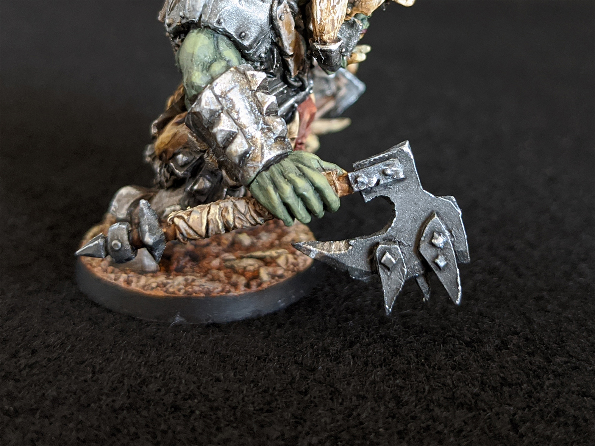
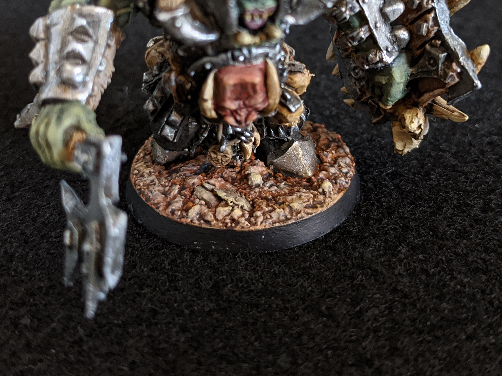

This is the <a href="https://en.avatars-of-war.com/collections/orcs-goblins/products/iron-black-orc-warlord-kit" target="_blank" rel="noopener noreferrer">Iron Black Orc Warlord, from Avatars of War</a>, painted by me. This mini actually comes as a kit, with two different heads, two one-handed axes, a shield, and a two-handed greataxe.

This is definitely the most detailed miniature I have painted thus far. It was so time consuming to get to all the little bits, but that's what I appreciate in a mini.

I could have gone with dual wielding axes or the big two-hander, but the shield was too cool to pass up.

This was a hard angle to get, but there are actually skulls hanging off the shield by their hair.

I did the base at the very end, after I had already attached the mini and then painted the whole thing. I hadn't done very much with the bases on my previous minis, and I just wasn't thinking about it when I decided to glue the mini on at the start. So it was probably a lot more difficult than it needed to be.

I mixed joint compound with some fine sand, spread it all around, and then added some slightly larger sand and rocks on top.

These are the only photos I have of the painting process. I started off with a base coat of orange that looked way too bright, but after some washes and dry brushing, turned out really nice.

