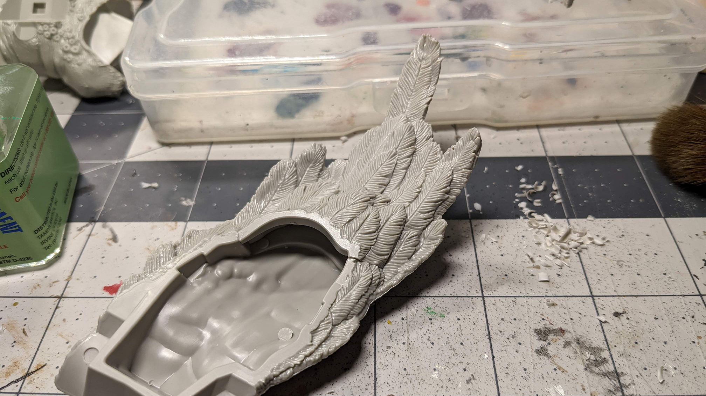
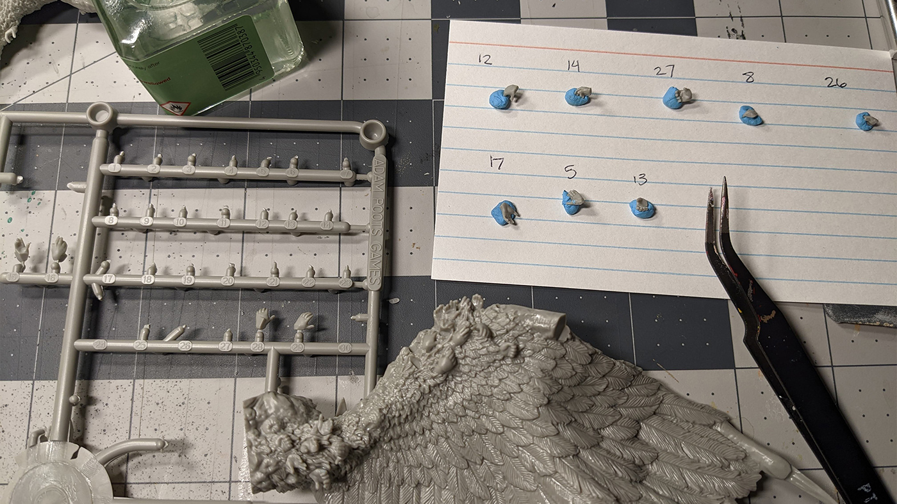
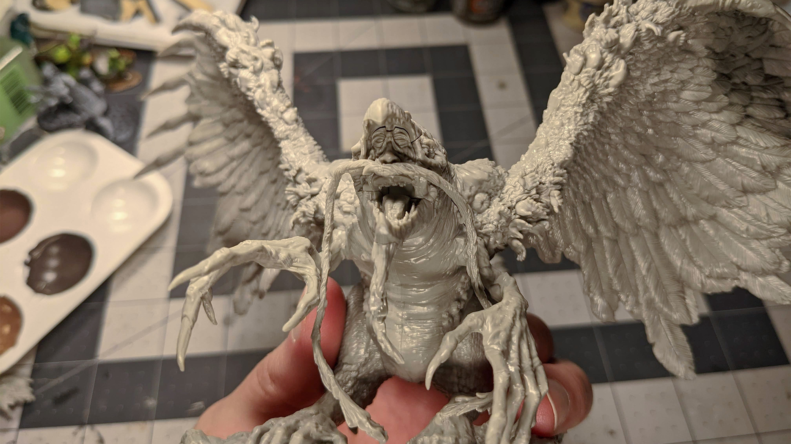
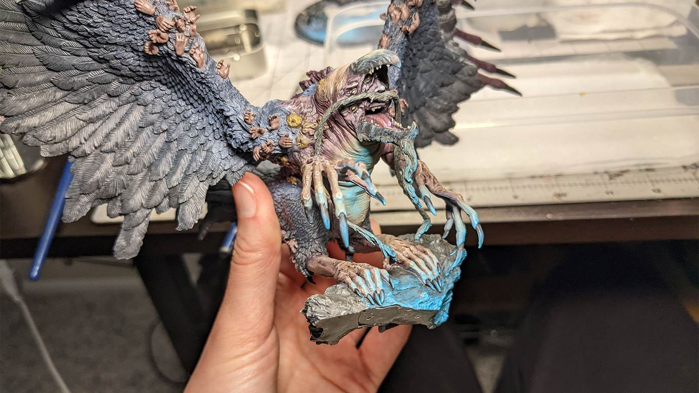

From Kingdom Death: Monster.

To paint this model I followed this excellent <a href="https://www.youtube.com/watch?v=O272Lk12p1o" target="_blank" rel="noopener noreferrer">tutorial from Sorastro</a>.

This project took a total of 89 hours, over 4 weeks. It's a stupid number of hours, I know. I used a lot of techniques I'm not very experienced with, but I think I got a few levels up.

I didn't take pictures with the goal of documenting a totally coherent process, but I hope they're somewhat interesting either way.

I also didn't do each step from start to finish in one go; I sometimes jumped around a lot, and the time shown for each one is a rough total.

# Assembly: 7 hours

The first two pieces. This is the center of the body.

The under-tail piece didn't fit right, unfortunately. Those top edges are supposed to be flush.

I had to chisel off a lot of the edges to get it close. You can see all the shavings in the corner.

In the end it came together pretty snugly.

Continuing on...

Assembling is kind of addicting, especially on such a big model. You can make a lot of progress very quickly and it's exciting to see it come together.

In hindsight I wish I would have taken the time to fill in the gaps and sand them smooth each time I added a piece, it would have been much easier to reach everything.

These pieces are for the face inside the beak.

### The dreaded tiny hands

Some of the hands on the wings are already built in, but 30 of them are not.

This part took 3 of the 7 total hours of assembly.

The official build instructions showed incorrect placement for several of the hands, and I had to look at other build guides and do a lot of my own trial and error.

I set aside and kept track of the hands that I couldn't find the right place for, while I moved on and attached the ones that were a definite fit.

The last several were anyone's guess, and I used blue tacky to dry fit them before sealing their fate.

Finally I can put the wings on.

Assembly complete!

The gaps are many and wide.

I know some people just leave them alone, but I just can't, especially on such an impressive mini.

# Gap filling/sanding: 14 hours

This is the finished filling. Almost all of it is Milliput; there's a little Vallejo plastic putty in there, but I only tried it on a few seams before I gave up after making a huge mess. I haven't figured out how to wield it yet.

It's always impossible to tell beforehand if the gaps will be smooth enough after painting.

# Priming: 2 hours

First a coat of solid black with an airbrush. I was prepared to go back and sand down any putty or mold lines that I missed, but it actually ended up clean enough.

I went ahead and did a grey zenithal highlight from above, then a white highlight from below to lay the foundation for the lighting coming from the pool.

Then I dry brushed the whole thing with white, to bring out the edges. It was particularly great for the feathers, which have so much detail.

# Base coat: 15 hours

# Building the base: 6 hours

I used bark chips and bits of cork to create a rocky ground. Above you can see the test base I made to see how the texture would turn out.

The bits of blue tacky are just marking where the model will sit.

Testing the fit:

And adding some skulls. They were the only bones we had.

I filled everything in with a mixture of joint compound and sand.

# Painting the base: 6 hours

Coated the base with Mod Podge to seal it.

Then primed with black, a zenithal coat of grey, and some white to brighten up where the water will be.

Finally the base colors.

# Object source lighting: 4 hours

# Attaching the base: 2 hours

There was a bit of a gap around the model after gluing it on, so I had to go back and fill it in with more joint compound and sand.

Then added the Mod Podge again for sealing.

After that I painted it to blend in with the ground as best I could.

# Water effects: 1 hour

I did three applications of Woodland Scenics realistic water, 24 hours apart. This is after the first application.

It looks perfectly smooth just after applying it.

But there is some shrinkage, and I did end up with a slightly bumpy surface.

This is the second coat, and the third smoothed it out a little more.

The last "step" to account for is the highlights and details; these totalled 30 hours, but are hard to show because I did some here and there in between other things, and didn't take good pictures of the progress. The wings (including the undersides) were 13 of those hours.

There are one or two touchups I would like to do, but I'm still pretty happy with it.

