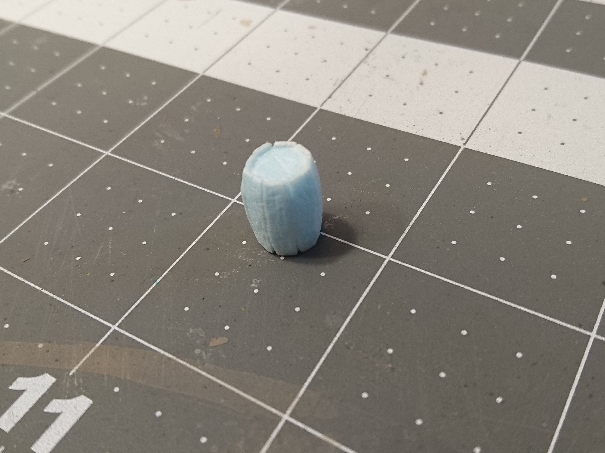

I had a disappointingly hard time finding resources online for making miniature barrels. Many were straight cylinders, without an outward curve to them, and the rest were too big or too bulky, or weirdly shaped, and I just didn't like the look of them. So I had to strike out into the unknown, and try something new.

This is the first attempt, so the process is somewhat haphazard. I also apologize in advance for the poor quality of many of the pictures. My efforts at trying to be a photographer were not enough to cure the potato-ness of my phone at such a small scale.

I did glean one important thing from my online search: I found this papercraft template. No way am I going to know how to figure out the exact curvature of each plank of a barrel. I printed it out at two sizes: one to make a 1/2" tall barrel and the other closer to 3/4" high. The wooden crate I made was 1/2" tall, so I thought, well, might as well just make the barrel the same. I added the 3/4" printout as a backup because 1/2" seemed incredibly small. And it definitely was.

Here's the piece of foam I cut to trace the pattern onto. I sliced a scrap piece vertically on the hot wire table.

I put a super thin piece of blue tack on the back of the template to keep it in place.

Using an exacto knife, I cut the foam around the template.

To make it look like the barrel is made out of separate planks of wood, I used my compass tip to draw lines in between each one. With a piece of foam this thin, it's really easy to go straight through, so I had to make them fairly shallow.

And then I made some even more shallow lines running vertically for the wood grain texture. It felt like the structural integrity of this little scrap of foam was just about destroyed at this point.

From the same starting piece of foam, I used my exacto knife to cut out the circles for the top and bottom of the barrel.

And then I had to figure out how to go about actually assembling this thing. The logical starting point seemed to be forming the main piece into a cylinder. Not thinking ahead, I put a tiny bit of tacky glue on one of the ends, and rolled it up with my fingers to put the ends together. I then realized that I had no hands free to do anything until the glue was set. I sat there holding it precariously together while I racked my brain for some kind of contraption that could hold this tiny thing exactly right. I thought up a lot of really dumb ideas, but in the end I just sat there holding it, and after many long minutes the glue dried enough to hold it together. It took much longer than normal because I got impatient and kept checking it, so it came apart more than once.

Next was to insert the top and bottom of the barrel. I put some glue just on one side of the little circle and fumbled around with tweezers until I got it to stick to one of the planks. My plan was to then just add more glue around the rest of the circle and bend all the tops of the planks in against it.

It didn't go well. I had nothing to hold everything in place well enough. Even trying to smush everything together with my fingers didn't work, because I couldn't keep all eight sides placed just right with four or five of my fingertips.

I needed something inside to hold the structure together. So I took measurements of everything I had so far to try and design something.

And here it is, a state-of-the-art barrel core. Comprised of three high tech cylinders; one wide cylinder in the middle, two narrower ones on the top and bottom.

I popped off one of the ends I had previously tried to glue in, stuck the core inside, and found that I didn't even need to put the end piece back on, since I had made the core a little too tall.

After that it was much easier to get everything glued, as I could just squish the pieces of this poor scrap as much as I needed to.

Goblin for scale. Pro tip: don't use a goblin for scale, use a regularly sized humanoid. This looks fine now, but on the table with player minis, it definitely runs a little small.

Back to more texturing, I drew in the planks and the wood grain on the top and bottom.

With the wooden part finished, I cut some tiny strips of regular cardstock to serve as the metal rings around each end.

Using a toothpick and tweezers I managed to get some white glue on them and stick them on.

Finally, time for painting. This is a coat of mod podge mixed with a tan paint.

Because the detailing and texture on the foam is so faint, I skipped a second coat of the base color and went straight to a dark brown wash.

The first wash faded quite a bit after it dried.

So I did another one, and laid it on pretty heavy.

After that I added some highlights. I wanted a more weathered look, so I mixed some grey into my tan that I used for the base coat.

To add even more darkness around the rings and in the cracks between the planks, I used a small brush and added more brown wash to those crevices.

For the rings, I got out my mini paints and used a metallic grey (GW Leadbelcher).

And then it seemed like the perfect time to use some of that Typhus Corrosion that I have used exactly once since I bought it like a year ago. It was a little tricky because I didn't want to just cover the metal entirely. I tried to stick to the center of the rings so that the edges would remain silver and have kind of a worn look to them.

Now that the finishing touches are done, time to see how it looks with everything else.

😓 So small.

On the bright side, I can go and make some bigger ones now, and they'll be so much easier. Maybe I'll use this tiny guy as part of a pile of crates and barrels or something, so he doesn't get lost.

