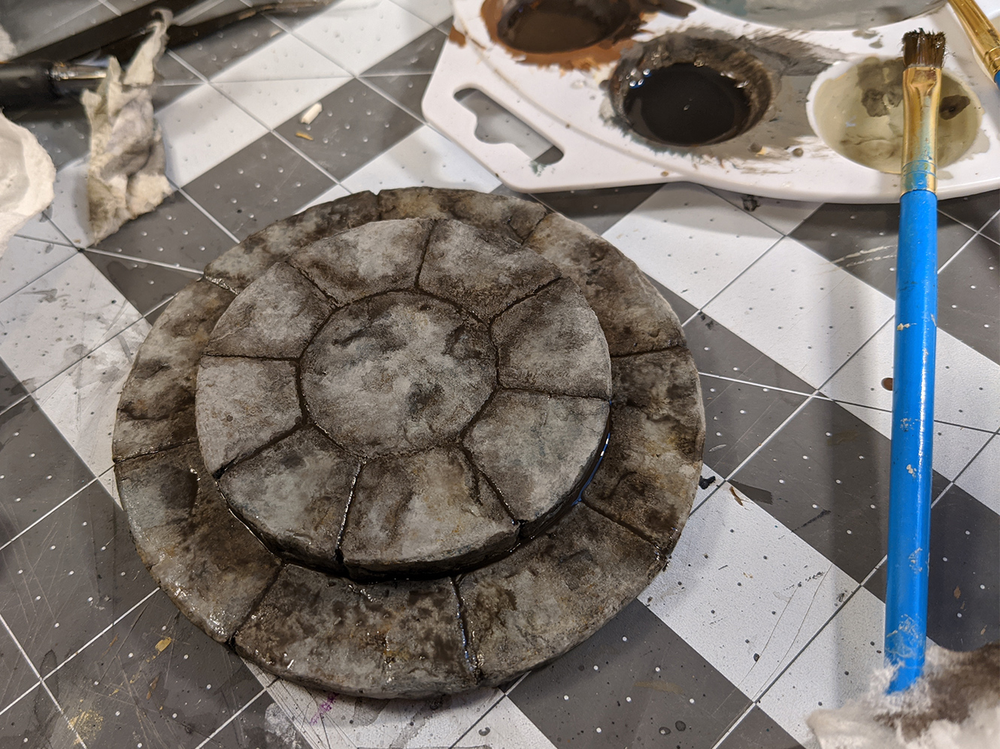

Disclaimer: this post isn't a very good how-to when it comes to the painting. I mostly messed around and only ended up learning what doesn't work. But oh well, learning is learning.

Here are two circles I cut out of foam with an exacto knife. The size and thickness totally doesn't matter here, all I bothered to pay attention to was that the lower step was wide enough for a mini to be able to stand on.

I used a compass to draw all the circles, so I have a hole on top here that I'll need to fill in later. The faint inner circle on top is where I'll be outlining the top ring of stones.

From that ring I lightly drew the lines between the stones, staggering them with the ones on the bottom piece.

I then went to town with a pen, trying to make the lines as deep as possible and rounding off the corners. And of course continuing the lines down the sides.

Rolled up tin foil for the first round of texturing.

To add a little more to the texture, I used a flat sculpting tool to press down some random areas, making some interesting indentations.

I also did some random scribbling with the pen that I felt real iffy about.

Filled up the hole on top with some joint compound. At this point I also glued the two pieces together with white glue.

Based with mod podge mixed with black paint. The brush strokes are pretty horrendous, and you'd think they'd just get covered up by the rest of the layers of paint, but I think they actually messed with the final texture.

For colors, I tried, yet again, to do a multi-colored stone thing. I keep thinking it's going to add realism and make the colors less flat. So here's some brownish and yellowish and greenish colored stones. (Since you've seen into the future, you know that these colors don't show up at all in the final piece.)

Started going over it with the main base color, plain grey. More terrible brush strokes.

Used more grey paint to try and fix that, but now the colors are all gone.

Let's try that again. This time, I'm using a sponge to dab on the colors (which I guess I decided to change up to blue and orange), and that way there are no brush strokes whatsoever.

I tried again with the coat of grey, trying to make it a little thinner and kind of stipple it on more than brush it.

I confess at this point I'm not even sure what exactly I'm going for paint-wise, so as far as I know this could be it.

So let's go ahead with the black wash.

I think that this is _not_ quite what I'm going for. Like the blue and yellow are too... blue and yellow. Maybe I've just been looking at it too long.

Tried to tone down the colors a bit with some very thin grey paint, dabbing it where I thought it was needed.

The gaps between the stones have mostly disappeared, so I did a selective black wash over the parts I wanted to accentuate.

Moar black wash.

Wash all dried. Getting closer? Except the colors are totally gone. I've invalidated 90% of the work I did.

Giving up on life, I did a light dry brushing with grey mixed with a little tan to finish it off. Kind of wish I could ctrl-z that, I definitely overdid it. Also, maybe no one else can see this, but I think this is where the brush strokes way back from the black base coat came back as those sort of grainy lines that the dry brush picked out.

So! If you want to paint something that looks like above, you can skip basically this entire process, do a base coat of grey, a wash in black, and then dry brush on some highlights in the light color of your choosing. I have a feeling it will look just about identical.

Other things I would have done differently: taken the hard route and built it out of individual bits of foam. The outlined stones just don't look enough like separate pieces. I avoided it initially because I thought getting the angles and curves of all the individual pieces and getting them to fit together and be nice perfect circles would be too hard, but now that I actually give it some thought, I probably could have just drawn out a template on paper and traced out all the pieces. That might work out pretty well. So maybe try that.

