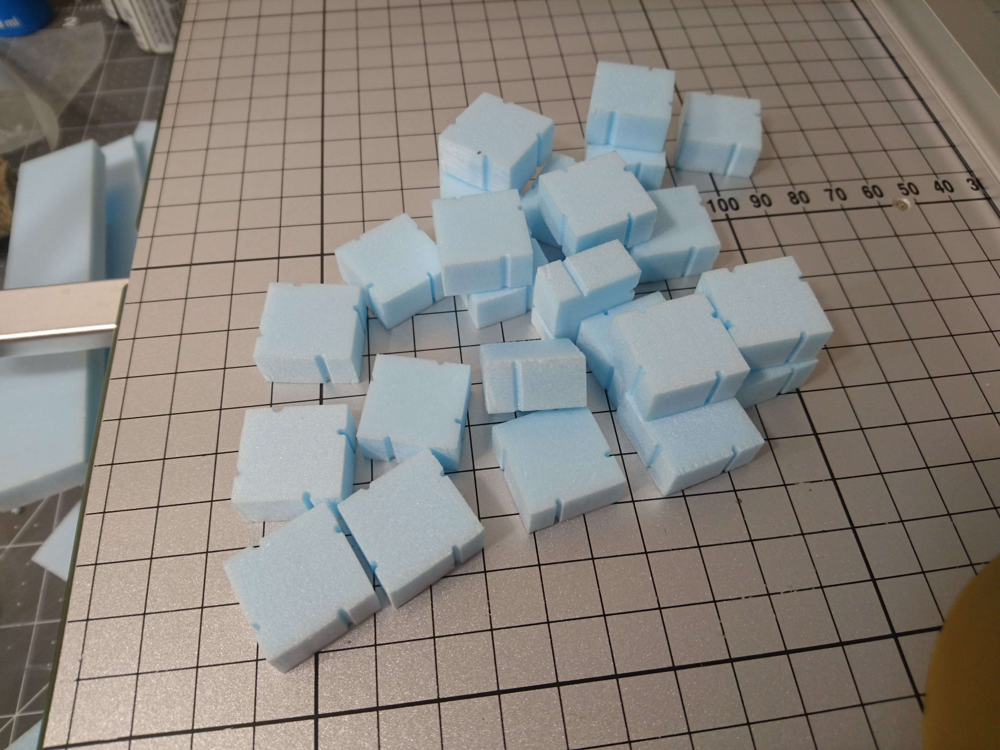
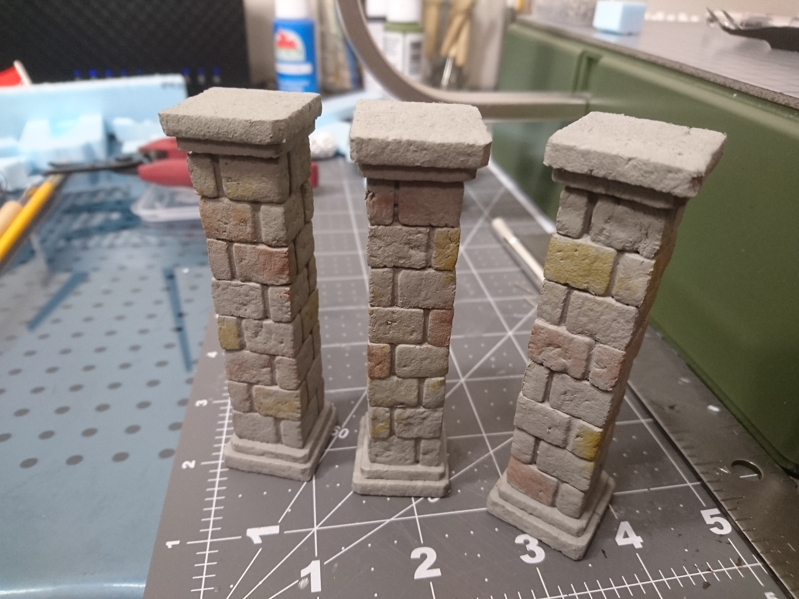

If you're trying to get together some generic dungeon scatter that you'll be able to reuse again and again, you can't go wrong with pillars. These pillars are the most generic I could come up with, and they should look good in any dungeon.

I started with a pretty simple design, making the pillars square and being 1x1-inch at the top and bottom, to fit into a grid square on a battle map.

There were supposed to be six pillars in total for the upcoming dungeon; four was the minimum, and I really wanted to make all six, but I'm well acquainted with the mistake of being optimistic about how much you can accomplish on a deadline.

I started with one pillar to test out the process, then used the refined methods on the remaining three.

Here are all the basic pieces cut out and ready to go. This project was great for using up a bunch of random foam scraps that were too small to be used for much else.

To make the brick pattern, I used the hot wire cutter to make a small indentation, the same way we make the grooves in our [dungeon tiles](../making-a-dungeon-tile/). For these stacking blocks I make the grooves at two-thirds of the width of each block, on each of the sides. (Only for the center blocks, not for the larger blocks at the top and bottom of course.)

They'll be stacked in opposite directions to create the alternating pattern.

Once the grooves were all cut, I used a sculpting tool to kind of push the corners of the bricks in, to make them a little rounded.

Smashing the corners doesn't work very well for the larger, thinner blocks at the top and bottom of the pillars, they sort of just bend to one side. So to round them off a bit I cut a little off of each corner.

For texture, I use the same method as we used on our dungeon tiles, which is to roll some balled up tinfoil and some rocks over the surface.

Something I didn't do on the first test pillar was run something through the core from top to bottom, so it doesn't snap in half. I found that a kitchen skewer worked pretty well; stronger and longer than toothpicks, and easier to get blocks onto than a dowel.

I marked the center of a couple blocks to start off the skewering, then used the side of the hot wire cutter as a straight edge to line the blocks up against as they go onto the kabob.

The largest top and bottom pieces are left without holes, but the second largest pieces will get skewered along with the bricks.

I then cut a piece of skewer the length of the pillar minus the very top and bottom blocks, (not including a pointy end). I glued the bottom two pieces together, then glued the cut skewer into the hole of the second piece.

Then each brick piece was stacked with glue, making sure that the grooves are on alternating sides.

I had to enlarge a hole here and there to get the blocks to line up.

Once all the tops are on it's on to the painting.

The base coat is the standard mod podge and paint mixture. This color is a plain old grey.

I wanted some different colored bricks in there for a more natural stone look. Based on some photos I checked out I thought a brownish-red and an orangish-yellow would do pretty well. For the orangey yellow I went with raw sienna.

Right now it looks like it might as well just be yellow.

The reddish brown is a mixture of espresso brown, red, and golden brown.

And it looks like it might as well just be red. Oh well.

Next I went to the plain black wash over everything.

It seemed not to stick too well. It might have been that the mod podge coat was a little too slick for the wash to soak in at all. I probably should have put on a second coat of just paint. Either way, at this point it hasn't done much to subdue the red and yellow.

So I put more black wash on, and I did a brown wash in some spots, mostly over the yellow and red.

Don't worry, I can't see much difference here either.

A different angle and lighting.

To fade out the yellow and red a little bit more, and to lighten things up overall, I painted some grey over some of the bricks. Not a solid coat though; I actually put it on kind of watered down and blotted it away with a paper towel where I put too much on. I also wasn't getting as much shadowing around the top and bottom crevices as I wanted, so I went over the tops and bottoms heavily with the black wash one last time.

And finally I did a grey dry brushing over all the edges and corners, making sure to catch the edges of any bricks that were sticking out.

This was one of those projects that I could have spent hours on, trying to tweak the colors over and over again and not making much progress. I have even more pictures of the process that past-me surely had some reason for taking, but present-me can't see the difference between any of them.

Regardless, I really like the way they turned out, and I did learn a few tricks while fiddling with the paint job.

And they worked out really well in our final boss fight.

