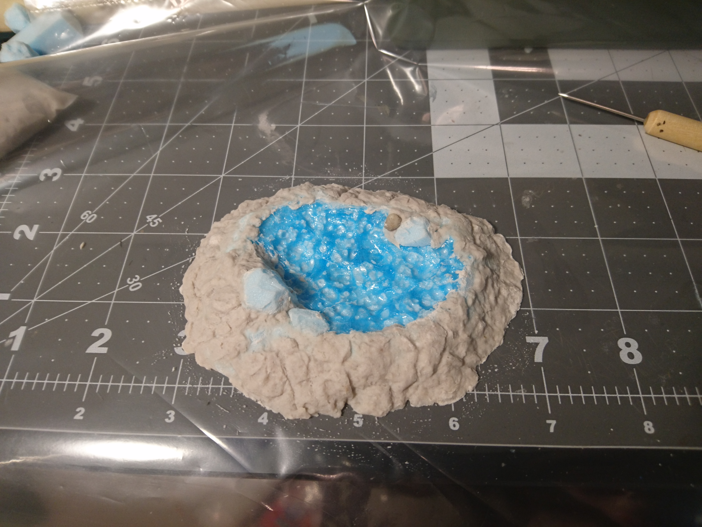
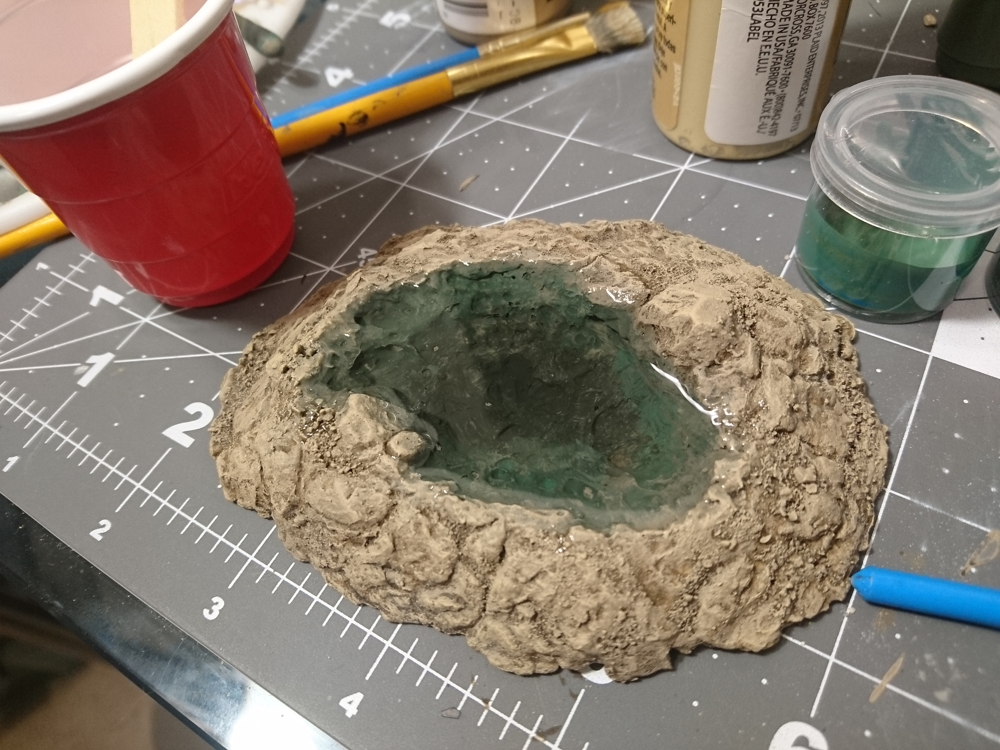

For our [cavern dungeon](../cave-tile-system/) we needed some river tiles, and I had never done anything with water effects or resin before, so I needed some practice. For a first attempt, I decided a small pool would be easiest.

I grabbed a scrap piece of XPS foam that seemed like a decent size.

I cut the corners freehand on the hot wire cutter until it was a round-ish shape.

Then I brushed a whole bunch of nail polish remover over the center until I had a pretty good indentation.

I started out using too little, so I had to hurry and glob it on in scary amounts over the parts that had already started hardening. I almost went clear through the bottom here, which I thought would turn out okay, but it ended up being a problem later on.

I ended up with a lot of melted foam goo (those are the dark blue parts) that I was worried would mess up the texture. I tried wiping some of it off while it was still wet, but that went terribly, and I had to go back in and melt some more to fix it.

After that I took it back to the hot wire cutter and started cutting the top edges to make the sides slope down to hopefully a nice transition to whatever it will be sitting on.

It still looked too tall, so I cut some of the height straight off the top and went back to sloping the sides more.

This will be just the general shape of the piece and not the final texture, so getting the cuts to look good isn't important.

I had some leftover foam rocks that I had made for some rubble piles, and I cut a few in half and placed them around the edges.

To add the final texture and set the rocks in place, I used paper mache around the outside of the pool.

This is my attempt at sculpting it to have more of a rocky texture.

This was way too time consuming and I was only semi-happy with the results, so I knew it wouldn't be feasible to do with all the rest of the river tiles.

I let the paper mache dry about halfway, then used a small paintbrush to brush in some watered down PVA glue in the cracks between the "rocks" and in any other places that were left smooth. I sprinkled construction sand over the whole thing, let it dry a bit, then shook it off.

After the paper mache and the glue were completely dry, I started on the base coat. I did a mixture of mod podge and dark taupe acrylic craft paint (about two parts mod podge to one part paint, though the amounts don't matter too much).

As you can see the paint doesn't stick to the melted foam at all. I had to go in with primer first.

I went over the primer with the base coat color for consistency, though after going through the whole process, I would probably leave the black as the undercoat for the painting to come.

Over the base coat I went straight to a dark brown wash around the exterior.

For the colors on the bottom of the pool, I wanted to go from a dark green in the center and fade it to the light brown color of the rocks at the edges.

I looked up a lot of pictures of rivers and lakes inside caves, and they were certainly not blue. Generally they were either greenish, or had no color to them but the color of the rocks around and beneath them.

I made three shades of green; the dark green is a mixture of olive green and black, the middle green is olive green mixed with a tiny bit of pure blue, and the light green is the middle green mixed with some of the stone color, a light taupe. I can't recall the exact ratios.

The lightest green I put right around the top edges.

It looks pretty decently covered at this point, but later on the brush strokes and the base coat underneath start standing out a lot more. Having black as the undercoat would probably have helped with that, as well as putting on multiple coats of the green paints.

After that I took some straight light taupe and used it to clean up the edges where the green had gotten outside of the pool.

I even blended it a little bit down into the pool so that the rocks nearest to the surface will look the clearest and closest to their natural color.

To finish off the exterior rocks, I started with a very heavy dry brushing of light taupe, then a lighter dry brushing with a lighter brown, and finally a very selective brushing of a light yellow brown.

Paints used:

This is the same painting process we used on our cave tiles; it matches okay, but the difference in texture here does make it stand out from the tiles quite a bit.

It's finally time to pour the resin. I used the Acrylic Water Kit from SimpleStyle, the same stuff used in this <a href="https://www.youtube.com/watch?v=9ZthDfZoxt4" target="_blank" rel="noopener noreferrer">Black Magic Craft water effects tutorial</a>.

The important thing to note here is how I did all this straight on my cutting mat without anything underneath, and how bad of an idea that was. Don't do what I did, put down some wax paper.

Anyway I poured the resin in up to where I imagined the water line to be.

... which ended up being too high. Some of the resin flowed over the edges and down the sides a little bit. I guess that's alright if you want some of the ground around your pool to be wet.

Here you can see the brush strokes I mentioned before, and the coverage doesn't look great at this point.

So if you remember, in the very beginning I nearly melted the foam clear through the bottom of the piece. Unfortunately, at some point it cracked, and the piece was resin-ed straight to my cutting mat. Fortunately, the amount that leaked out was relatively small, and after wrestling with it ever so carefully, I got it unstuck and onto a plastic sheet protector to finish drying. And I was able to clean _most_ of the resin off the cutting mat.

You can see I also forgot to base coat the bottom with mod podge, which might have helped to seal it and give it a little more strength.

The water level definitely dropped, but it's still a pretty nice piece.

After completing this guy I went on to make the [river tiles](../making-water-tiles/) that were the real purpose of this project.

I hadn't planned on this pool being used at all, but it ended up in the dungeon anyway.

